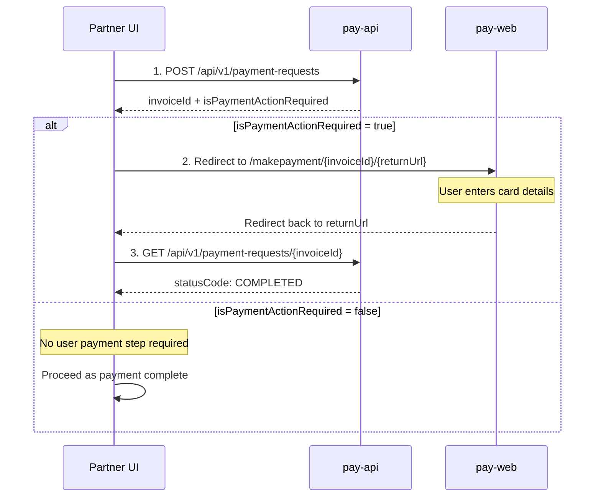

# Credit Card Payment Integration Guide

For product teams (Registries, PPR, NRO, Business Registry, etc.)
integrating credit card payments with a BCROS account.

Credit card integration is a three-step handoff:

1.  Create the payment request.
2.  Redirect the user to pay-web if `isPaymentActionRequired` is `true`.
3.  Query the invoice status when the user is redirected back to your
    app.

## 1. Sequence



## 2. Step 1 - Create the payment request

### Request

``` http
POST /api/v1/payment-requests
```

### Headers

``` text
Authorization: Bearer <keycloak-jwt>
Account-Id: <auth-account-id>
```

-   `Authorization`: the end user's session token.
-   `Account-Id`: the BCROS account that owns this payment.

### Body

``` json
{
  "businessInfo": {
    "corpType": "CP",
    "businessIdentifier": "CP0001234",
    "businessName": "Example Co-op"
  },
  "filingInfo": {
    "folioNumber": "MY-REF-001",
    "filingTypes": [
      {
        "filingTypeCode": "OTANN",
        "priority": false
      }
    ]
  }
}
```

### Response

``` json
{
  "id": 1234567,
  "statusCode": "CREATED",
  "paymentMethod": "CC",
  "total": 30.00,
  "serviceFees": 1.50,
  "isPaymentActionRequired": true
}
```

Keep `id` --- it is the `invoiceId` used in the next two steps.

## 3. Step 2 - Check the flag, then redirect

Branch on `isPaymentActionRequired`:

### `true`

Redirect the browser to pay-web's make-payment page, passing the invoice
ID and the URL you want the user returned to.

Coordinate the exact URL pattern with the SBC Connect team for your
environment. It typically looks like:

``` text
https://<pay-web-host>/makepayment/{invoiceId}/{returnUrl}
```

**Important:** URL-encode `returnUrl` before appending it.

### Pay-web hosts

  Environment   Host
  ------------- ---------------------------------------------
  TEST          `https://test.account.bcregistry.gov.bc.ca`
  PROD          `https://account.bcregistry.gov.bc.ca`

**PS:** Share the `redirectUrl` with the BCROS team to add to the safe
list.

### `false`

Nothing more to do. The invoice does not require a user-driven payment
step.

Proceed as if payment is complete.

## 4. Step 3 - Query status on return

When pay-web sends the user back to your `returnUrl`, ask pay-api for
the current state of the invoice:

``` http
GET /api/v1/payment-requests/{invoiceId}
```

Check `statusCode`:

  -----------------------------------------------------------------------
  `statusCode`                        What it means
  ----------------------------------- -----------------------------------
  `COMPLETED`                         Payment succeeded. Proceed with the
                                      filing / downstream work.

  `CREATED`                           User did not complete payment, or
                                      the return fired early. Offer them
                                      a way to resume payment.

  `DELETED`                           Invoice was voided. Treat as
                                      failed.
  -----------------------------------------------------------------------

> **Important:** Do not treat "the user landed on my returnUrl" as proof of success --- always re-query.
