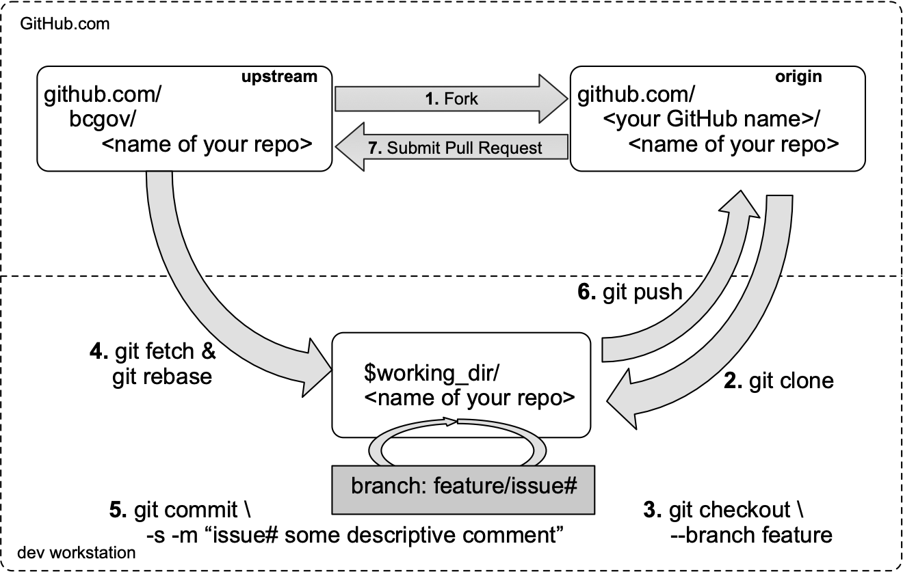

## Workflow



### 1 Fork in the GitHub

1. Visit https://github.com/bcgov
2. Select the repo you want to work on
3. Click `Fork` button (top right)
4. Select your GitHub account as the destination

### 2 Clone fork to your workstation

Create your clone:

```sh
export working_dir=<your workstations dir>
export user=<your GitHub name>
export repo=<name of your repo>
mkdir -p $working_dir
cd $working_dir
git clone https://github.com/$user/$repo.git
 
cd $working_dir/$repo 
git remote add upstream https://github.com/bcgov/$repo.git
 
# Never push to upstream main
git remote set-url --push upstream no_push

# Confirm that your remotes make sense:
git remote -v
```

### 3 Branch

Get your local main up to date:

```sh
cd $working_dir/$repo 
git fetch upstream
git checkout main
git rebase upstream/main
```

Branch from it:
```sh
git checkout -b <feature# from ZenHub>-<short_name_for_this_work>
```

#### Test
Make sure to add tests for your feature and that they all pass.
 
### 4 Keep your branch in sync

```sh
# While on your myfeature branch
git fetch upstream
git rebase upstream/main
```

Please don't use `git pull` instead of the above `fetch` / `rebase`. `git pull`
does a merge, which leaves merge commits. These make the commit history messy
and violate the principle that commits ought to be individually understandable
and useful (see below). You can also consider changing your `.git/config` file via
`git config branch.autoSetupRebase always` to change the behavior of `git pull`.

### 5 Commit

Commit your changes.

```sh
git commit -s -m "a useful comment including the issue #"
```
Likely you will need to go back and edit/build/test some more.
Use `commit --amend` in a few cycles.

### 6 Push

When ready to review (or just to establish an offsite backup or your work),
push your branch to your fork on `github.com`:

```sh
git push origin myfeature
```

### 7 Create a pull request

1. Visit your fork at `https://github.com/<username>/<repo>`
2. Click the `Compare & Pull Request` button next to your `myfeature` branch.


#### Get a code review

Once your pull request has been opened it will be assigned to one or more
reviewers.  Those reviewers will do a thorough code review, looking for
correctness, bugs, opportunities for improvement, documentation and comments,
and style.

Commit changes made in response to review comments to the same branch on your
fork.

Very small PRs are easy to review.  Very large PRs are very difficult to review.

#### Squash and Merge

Upon merge (by either you or your reviewer), all commits left on the review
branch should represent meaningful milestones or units of work.  Use commits to
add clarity to the development and review process.

Before merging a PR, squash any _fix review feedback_, _typo_, _merged_, and
_rebased_ sorts of commits.

It is not imperative that every commit in a PR compile and pass tests
independently, but it is worth striving for.

In particular, if you happened to have used `git merge` and have merge
commits, please squash those away: they do not meet the above test.

A nifty way to manage the commits in your PR is to do an [interactive
rebase](https://git-scm.com/book/en/v2/Git-Tools-Rewriting-History),
which will let you tell git what to do with every commit:

```sh
git fetch upstream
git rebase -i upstream/main
```

For mass automated fixups (e.g. automated doc formatting), use one or more
commits for the changes to tooling and a final commit to apply the fixup en
masse. This makes reviews easier.

## attribution
this page heavily borrowed from the kubernetes.io project - thx from our Registries team!!
