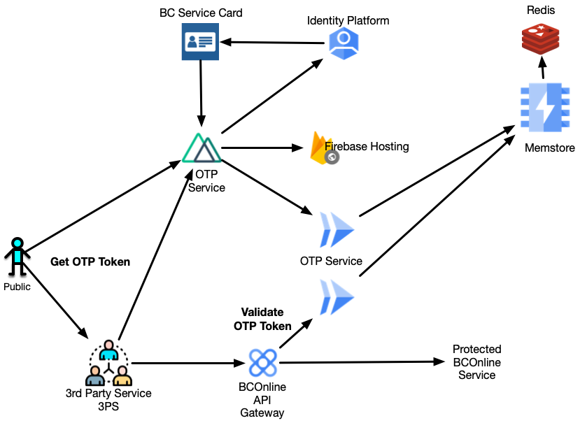
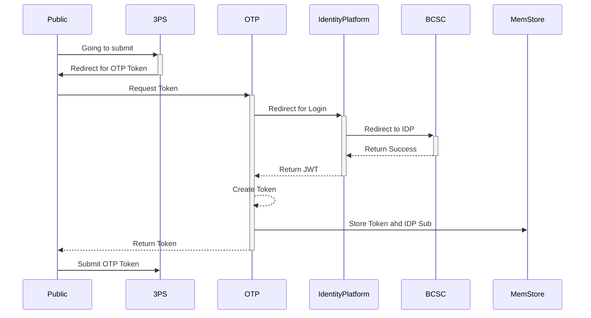
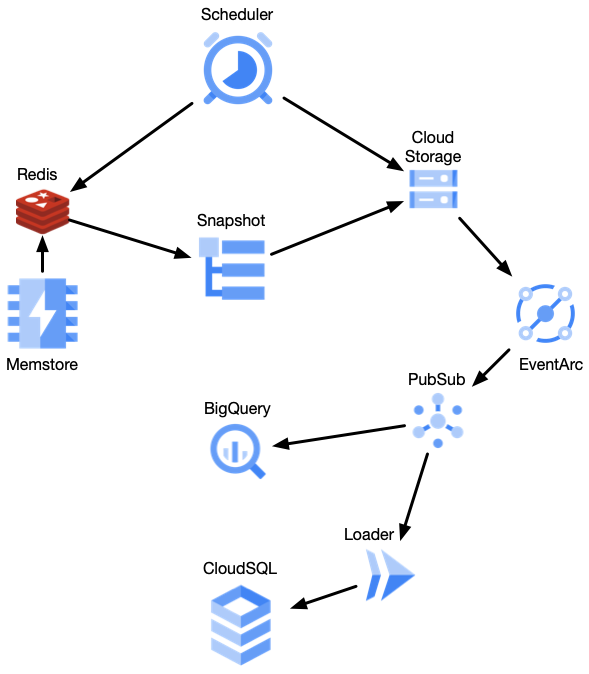

- Start Date: 2023-03-21
- Target Major Version: 
- Reference Issues: 
- Entity Issue: #entity/issues/15698
- Implementation PR: (leave this empty until completed)

# Summary

Provide a service that will allow 3rd parties to leverage the gov't IDIM that strongly identifies a person and meets the KYC (Know Your Customer) requirements that are in the API Terms of Use agreement.

# Motivation

The Registry and Online Services needs to ensure that known individuals are using their services. This requires 3rd Party API consumers to perform enough KYC to identify the consumer of their services and keep information to support audits and legal investigations as required by the Province.

When BCOnline was managed by a commercial entity, it allowed 3rd parties to use its identity services. Other jurisdictions also allow their 3rd Party Service Providers to leverage their national identity services.

Canada does not have a national identity service, and the Provincial identity services have legal restrictions that prohibit direct connections into the identity infrastructire and services.

BC Registries and Online Service is shutting down the legacy services and where appropriate an within its control, is providing alternatives that can be used to meet existing business and technical requirements.

# Basic example

A customer is using a 3rd Party Service (3PS) that leverages the BCOnline services. When the 3PS starts its submission to BCOnline it makes a call and redirect to the BCOnline auth service. The customer logs into BCOnline and a OTP code is returned to the 3PS. The 3PS then does the submission to a BCOnline hosted service and includes the OTP code. It is validated and the transaction is linked to the citizens login.

This meets the 3PS requirement to perform KYC for the customer using their service.

This works for anyone in Canada.

# Detailed design

The public user will submit a request to a BCOnline Providing partner via the 3rdp Party Service Provider. To validate the the public user, it redirects the user to the OTP service and the user logins using their BC Services Card. A OTP Token is provided and saved in a Redis backed Memstore.
The OTP Token is included in the submission through the gateway to the protected BCOnline Service.

On a scheduled basis, the tokens, timestamps and user sub are snapshoted into CloudStorage. This emits an EventArc CloudEvent that triggers a PubSub topic. The storage data is then either drained to BigQuery, just left in storage, or loaded to CouldSQL for audit and analytics use.

# Drawbacks

Performing KYC on their customers is the responsibility of the 3rd party service provider. Large organizations or those forming longterm relationship with their customers will not find value in this service.

# Alternatives

For smaller 3rd party service providers there are not a lot of cost effective alternatives, and BCOnline provides a similar service in the legacy system that is being retired. A point to note is that BCOnline Legacy uses it own authentication service and not one of the IDIM services today.

# Adoption strategy

If adopted it should be made available in 3 phases:
1. Provide an early adopter use to test the service and make sure it warks as required.
2. Update the Gateway to validate the OTP token, protecting the downstream services from receiving bad tokens.
3. Allow accounts to require that either the OTP token or a field denoting the 3PS as keeping the KYC record.
4. Update the required headers such that service explicitly include the OTP to or 3PS-KYC record if the account requires it.

# Unresolved questions

None at this time.

# Thanks

This template is heavily based on the Vue, Golang, React, and other RFC templates. Thanks to those groups for allowing us to stand on their shoulders.
