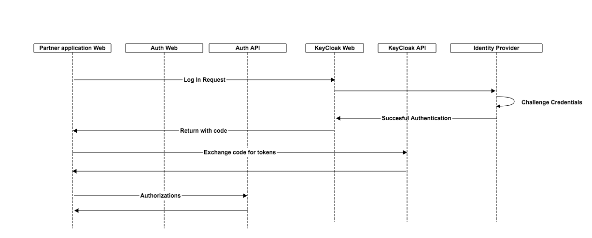
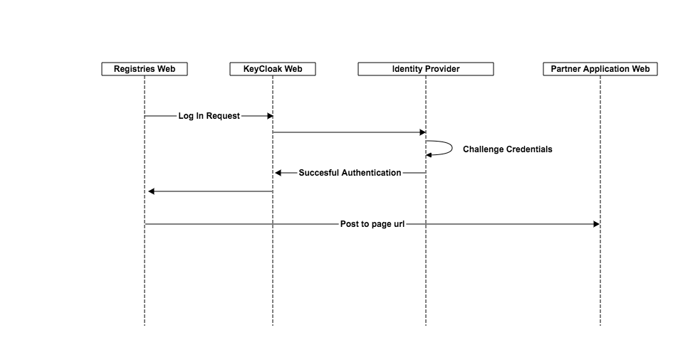
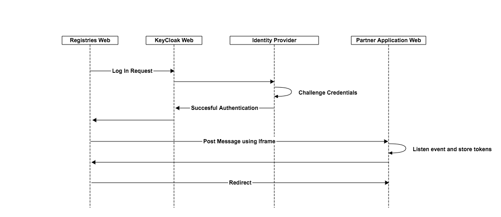
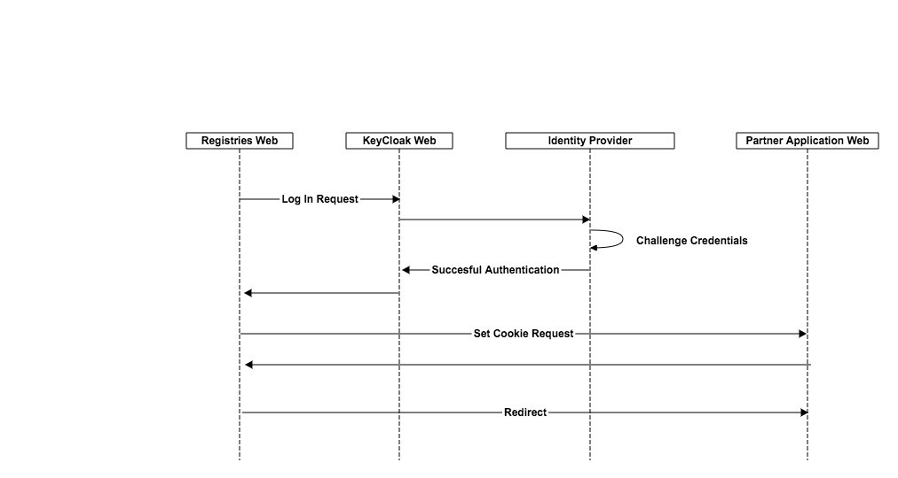
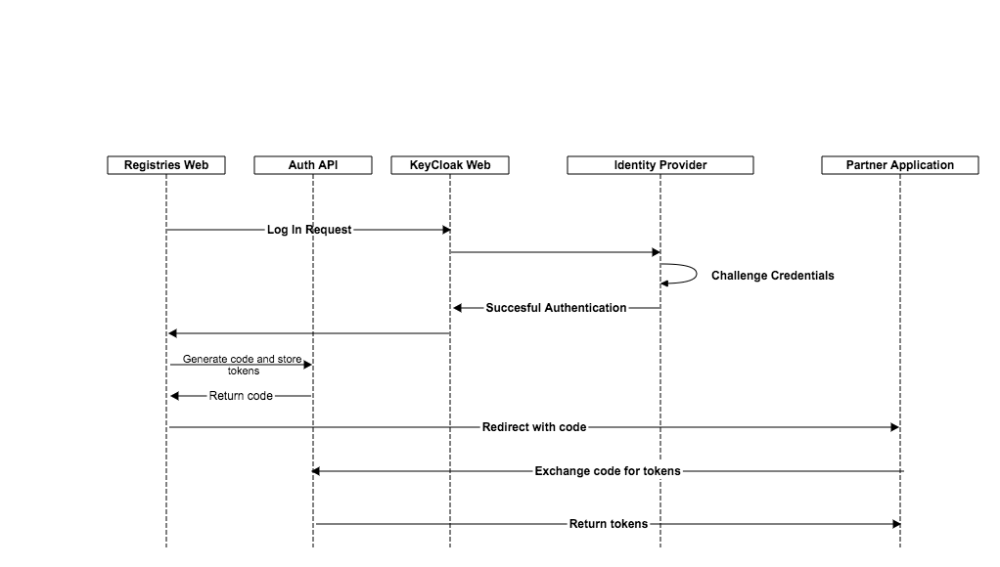

- Start Date: 2020-01-14
- Target Major Version: Authentication and Authorization
- Entity Issue: https://github.com/bcgov/entity/issues/1985
- Implementation PR: 

# Summary

BC Online partner applications like BC Assessment, BC Vital Stats etc. would need to use the BC Online Auth platform to avail BC Online services. Currently when the user logs in the access/refresh token is shared under same domain. This works for only for applications under same domain (all of BC registries applications built on same platform).
This solution is not scalable for partner applications whc hosts their application in their own domain. 

Intention of this RFC is to list down some potential solution options and requests for comments or alternate solutions.

# Solution Options
## 1) Client application to Integrate with Keycloak Integration
### Summary
Client redirects to keycloak where the user authenticates and gets redirected back to their application on succesfull login. Client application would need to do the code exchange to get the access and refresh tokens. 

#### Pros
- Less work on registries side, would be mostly configuration

#### Cons
- This approach solves only authentication; user wouldn't be able to setup their account or registries won't be able to perform any validations/business rules before the user is sent to client application.
- Introduces KeyCloak dependency on client application. Client application would need to keep the keycloak configs and would need to handle all integration with keycloak from their application. 

## 2) Perform a document post with tokens
### Summary
Upon authentication for the user to navigate to the client application, perform a document POST with tokens populated as elements. 

#### Pros
- Client application doesn't have Keycloak dependency as in option 1
#### Cons
- This will work only if the client application is using server side rendering.

## 3) Cross-Domain Messaging using Iframe
### Summary
Registries application would post an iframe message to document in client application with tokens, and client application can receive the tokens using window event listener.

#### Pros
- Easy to implement and has been initially adopted in BC Registries before moved all apps under same domain

#### Cons
- Registries app would need to load the client application in iFrame.
- If the client application has X-FRAME-OPTIONS to DENY or SAMEORIGIN, this will prevent the app being loaded in iFrame and won't be able to receive the tokens. For web applications this value is normally not provided and allows the app to be included as IFrame unless specified, but some portal platform enforces this.

## 4) Cross-domain Cookie
### Summary
Registries application would set cookies in client application domain. Client applications need to create a dynamic page where it sets the cookie. Registries application creates a hidden image upon user authentication which points to the dynamic page on the client application, and pass the tokens. Registries team would be able to provide a javascript util to handle this. 

#### Pros
- Similar to iFrame approach and has been generally by some known products. 

#### Cons
- If third party cookie is disabled in browser, the solution won't work.

## 5) Custom solution using code exchange
### Summary
Registries application will store the tokens for the user session in database/cache and  will redirect the user to the client application using a code. The client application can make an api call to exchange the code to get the tokens. The code will be short-lived (30 seconds) and is for one time use. 

#### Pros
- This solution would provide more options for us to implement any security standards as the token sharing flow is service-to-service calls.
- Doesn't depend on any browser features like iframe events, cookie etc.

#### Cons
- Fully custom solution and may need more effort than other solutions.
  
# Recommendation
Team has decided to go with Option 1. Client would integrate with KeyCloak directly, i.e, authentication is handled by keycloak and authorization handled by Registries auth system. KeyCloak being an OIDC provider, client system which uses any technology to implement their application would be able to easily integrate with Keycloak.

# Adoption strategy
Team has decided that all internal applications will be using same mechanism to authenticate the users. Entities application will be the first client to implement this change, which will help us to refine the solution before any external partner application integrates.

# Thanks

This template is heavily based on the Vue, Golang, React, and other RFC templates. Thanks to those groups for allowing us to stand on their shoulders.

