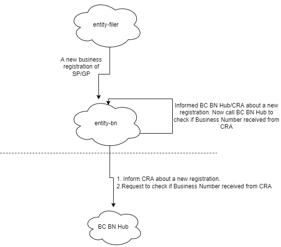
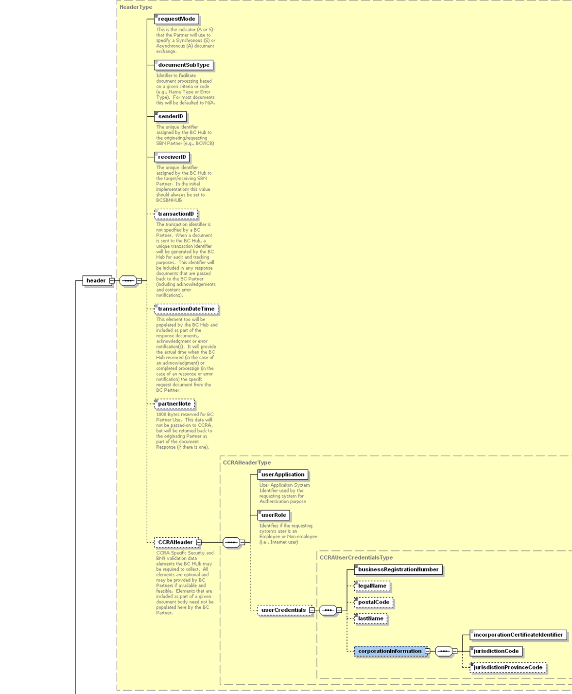
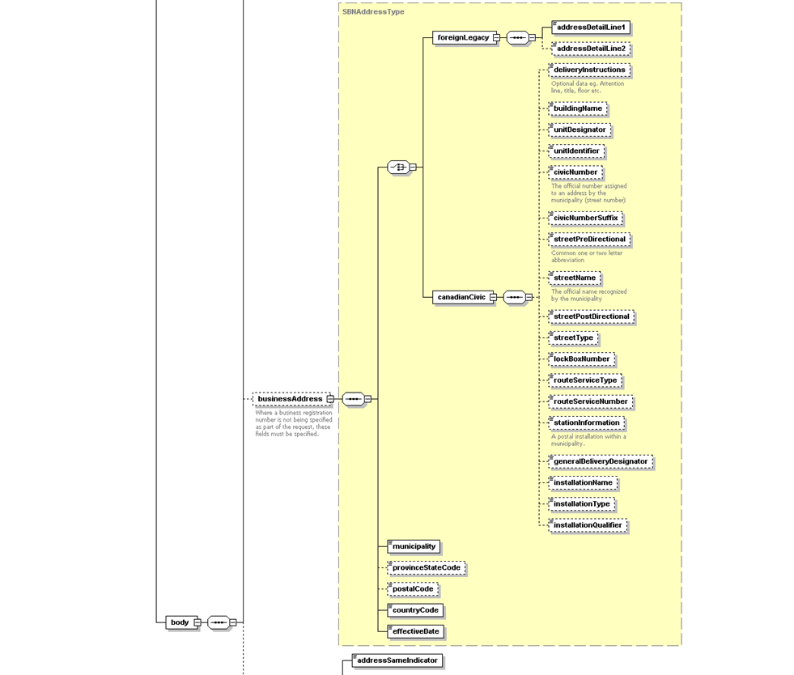
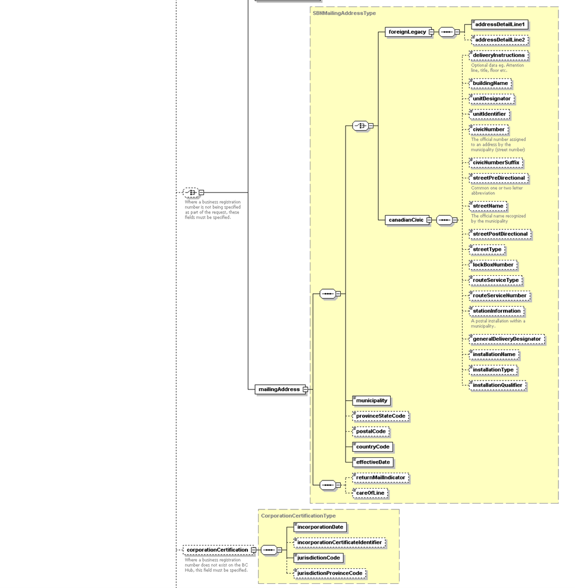
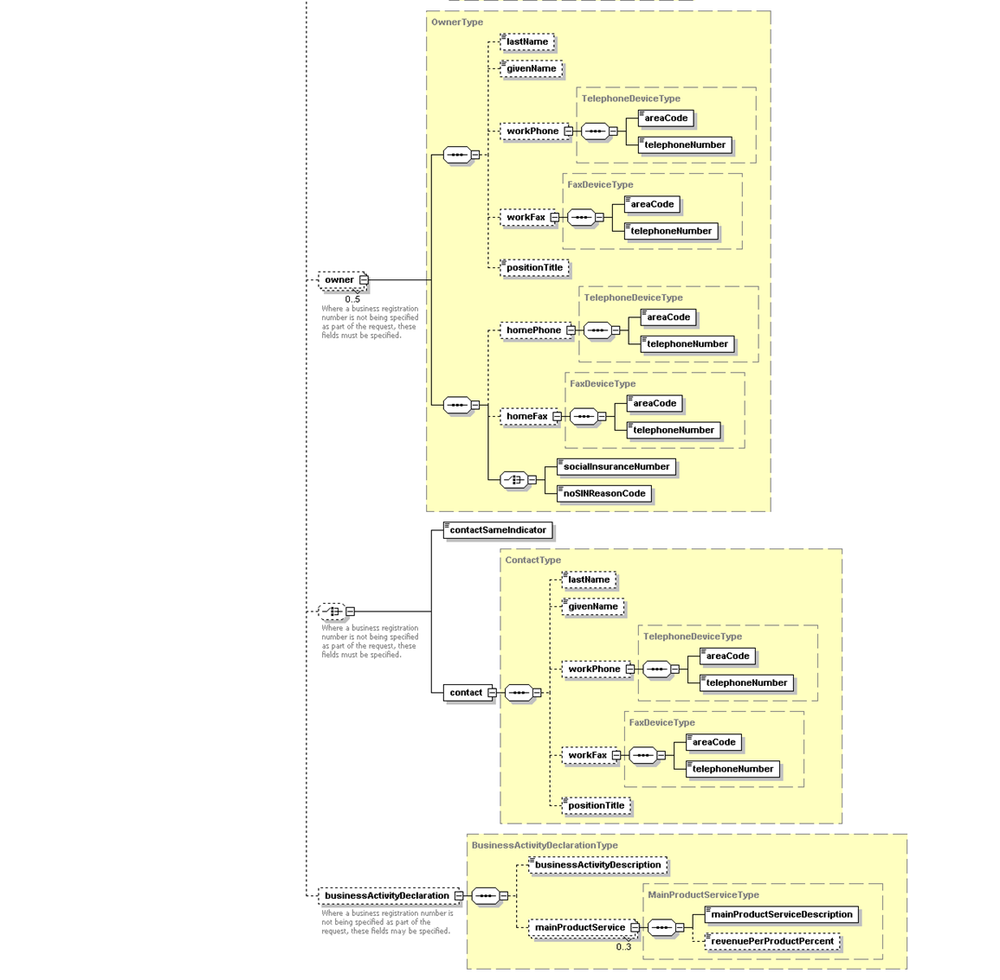
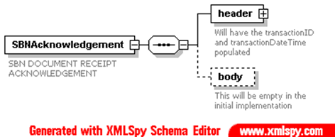
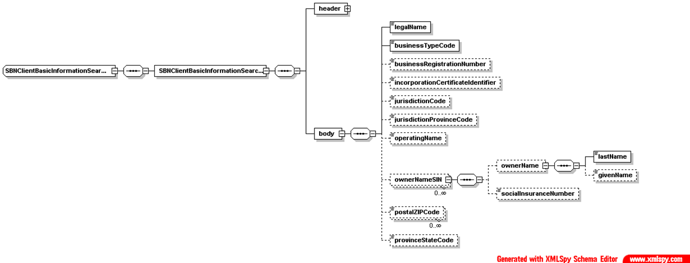
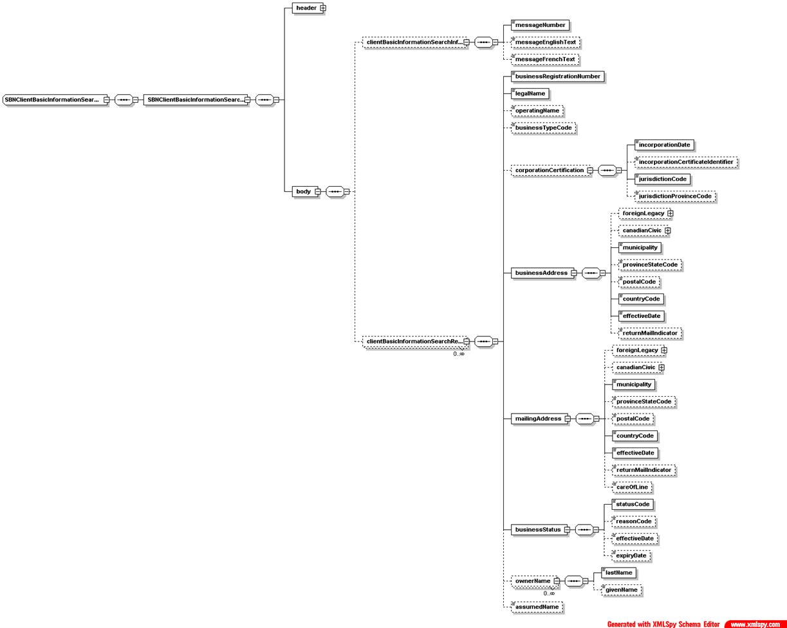
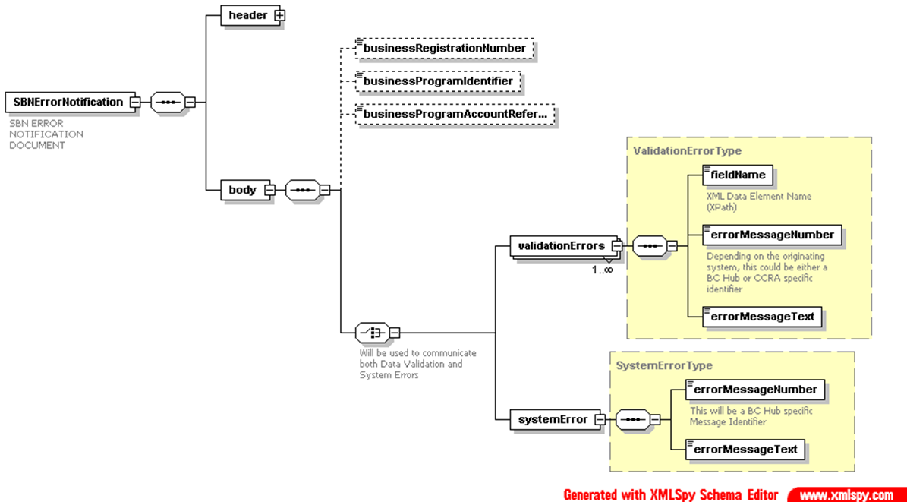

- Start Date: 2022-04-07
- Target Major Version:
- Reference Issues: [9434](https://github.com/bcgov/entity/issues/9434)
- Entity Issue: 
- Implementation PR: (leave this empty)

# Summary

This RFC outlines how to send SP/GP registration details to CRA and receive BN (business number) back.

# Motivation

To provide a way for lear to send SP/GP registration details to CRA and receive BN (business number) back
without going through colin api.

# Detailed design

This RFC is to identify the way to inform CRA about SP/GP registration by using existing webservice called
OneStop/BC BN Hub in registry.

Lear make 2 calls, one to inform OneStop and another one to receive Business Number. It is possible to reduce it 
to single call but the response for that call may be longer that expected and might need to handle different errors. 
So the suggestion is to make the first call to create program account request and receive acknowledgement from OneStop 
and later make a second call to do basic information search request to get Business Number (Repeat the second call 
until OneStop receives the Business Number from CRA).

The interation between OneStop uses XML/SOAP via HTTPS. Both calls mentioned below will be HTTP GET call to the 
same url (`/rest/REST/BCPartner`) with a query parameter `inputXML` and OneStop identifies the call based on the 
XML provided in `inputXML`

### 1. Inform BC BN Hub (Create Program Account Request)

Request Sample
```xml
<?xml version="1.0"?>
<SBNCreateProgramAccountRequest>
  <header>
    <requestMode>A</requestMode>
    <documentSubType>000</documentSubType>
    <senderID>CPPR</senderID>
    <receiverID>BCSBNHUB</receiverID>
    <partnerNote>1324909</partnerNote>
    <CCRAHeader>
      <userApplication>BI</userApplication>
      <userRole>01</userRole>
    </CCRAHeader>
  </header>
  <body>
    <businessProgramIdentifier>BC</businessProgramIdentifier>
    <SBNProgramTypeCode>113</SBNProgramTypeCode>
    <businessCore>
      <programAccountTypeCode>01</programAccountTypeCode>
      <crossReferenceProgramNumber>FM1006249</crossReferenceProgramNumber>
      <businessTypeCode>01</businessTypeCode>
      <businessSubTypeCode>01</businessSubTypeCode>
    </businessCore>
    <programAccountStatus>
      <programAccountStatusCode>01</programAccountStatusCode>
      <effectiveDate>2022-03-11</effectiveDate>
    </programAccountStatus>
    <legalName>test test</legalName>
    <operatingName>
      <operatingName>DALLAS/WATERFORD ESTATES INVESTMENTS I LIMITED PARTNERSHIP</operatingName>
      <operatingNamesequenceNumber>1</operatingNamesequenceNumber>
    </operatingName>
    <businessAddress>
      <canadianCivic>
        <civicNumber>222</civicNumber>
        <streetName>GREENLEA</streetName>
        <streetType>PL</streetType>
      </canadianCivic>
      <municipality>VICTORIA</municipality>
      <provinceStateCode>BC</provinceStateCode>
      <postalCode>V8Z6N1</postalCode>
      <countryCode>CA</countryCode>
    </businessAddress>
    <mailingAddress>
      <canadianCivic>
        <civicNumber>222</civicNumber>
        <streetName>GREENLEA</streetName>
        <streetType>PL</streetType>
      </canadianCivic>
      <municipality>VICTORIA</municipality>
      <provinceStateCode>BC</provinceStateCode>
      <postalCode>V8Z6N1</postalCode>
      <countryCode>CA</countryCode>
    </mailingAddress>
    <owner>
      <ownerIndividual>
        <lastName>test</lastName>
        <givenName>test</givenName>
      </ownerIndividual>
    </owner>
    <businessActivityDeclaration>
      <businessActivityDescription>Tourism</businessActivityDescription>
    </businessActivityDeclaration>
  </body>
</SBNCreateProgramAccountRequest>
```
Response Sample
```xml
<?xml version="1.0"?>
<SBNAcknowledgement>
	<header>
		<requestMode>A</requestMode>
		<documentSubType>000</documentSubType>
		<senderID>BCSBNHUB</senderID>
		<receiverID>CPPR</receiverID>
		<transactionID>BNT4LX4UKN2</transactionID>
		<transactionDateTime>2022-04-05-10.25.44.434000</transactionDateTime>
		<partnerNote>1324909</partnerNote>
		<CCRAHeader>
			<userApplication>BI</userApplication>
			<userRole>01</userRole>
		</CCRAHeader>
	</header>

	<body>A Valid SBNCreateProgramAccountRequest Document Type was received.</body>
</SBNAcknowledgement>
```

### 2. Request BC BN Hub for Business Number (Client Basic Information Search Request)

Request Sample
```xml
<?xml version="1.0"?>
<SBNClientBasicInformationSearchRequest>
  <header>
    <requestMode>S</requestMode>
    <documentSubType>000</documentSubType>
    <senderID>BCSBNHUB</senderID>
    <receiverID>BCSBNHUB</receiverID>
    <CCRAHeader>
      <userApplication>BI</userApplication>
      <userRole>01</userRole>
    </CCRAHeader>
    <partnerUserID>BCSBNHUB</partnerUserID>
  </header>
  <body>
    <legalName>Patrick Wei</legalName>
    <businessTypeCode>01</businessTypeCode>
    <postalZIPCode>V8W3E6</postalZIPCode>
  </body>
</SBNClientBasicInformationSearchRequest>
```

Response Sample
```xml
<?xml version="1.0"?>
<SBNClientBasicInformationSearchResponse>
	<header>
		<requestMode>S</requestMode>
		<documentSubType>000</documentSubType>
		<senderID>CCRABN</senderID>
		<receiverID>BCSBNHUB</receiverID>
		<transactionID>BNTVO6C1B8J</transactionID>
		<transactionDateTime>2022-04-07-15.31.55.159000</transactionDateTime>
		<CCRAHeader>
			<userApplication>BI</userApplication>
			<userRole>01</userRole>
		</CCRAHeader>
	</header>

	<body>
		<clientBasicInformationSearchInformationMessage>
			<messageNumber>70377</messageNumber>
			<messageEnglishText>Exact Match</messageEnglishText>
			<messageFrenchText>Concordance exacte</messageFrenchText>
		</clientBasicInformationSearchInformationMessage>
		<clientBasicInformationSearchResult>
			<businessRegistrationNumber>993775204</businessRegistrationNumber>
			<legalName>Patrick Wei</legalName>
			<operatingName>ROY&#39;S SOLE PROP</operatingName>
			<businessTypeCode>01</businessTypeCode>
			<corporationCertification>
				<incorporationDate />
				<incorporationCertificateIdentifier />
				<jurisdictionCode />
				<jurisdictionProvinceCode />
				<jurisdictionCountryCode />
				<jurisdictionStateCode />
			</corporationCertification>
			<businessAddress>
				<foreignLegacy>
					<addressDetailLine1>940 BLANSHARD ST</addressDetailLine1>
					<addressDetailLine2 />
				</foreignLegacy>
				<municipality>VICTORIA</municipality>
				<provinceStateCode>BC</provinceStateCode>
				<postalCode>V8W3E6</postalCode>
				<countryCode>CA</countryCode>
				<returnMailIndicator>0</returnMailIndicator>
			</businessAddress>
			<mailingAddress>
				<foreignLegacy>
					<addressDetailLine1>940 BLANSHARD ST</addressDetailLine1>
					<addressDetailLine2 />
				</foreignLegacy>
				<municipality>VICTORIA</municipality>
				<provinceStateCode>BC</provinceStateCode>
				<postalCode>V8W3E6</postalCode>
				<countryCode>CA</countryCode>
				<effectiveDate>2022-08-17</effectiveDate>
				<returnMailIndicator>0</returnMailIndicator>
				<careOfLine />
			</mailingAddress>
			<clientEvents>
				<eventCode>03</eventCode>
				<effectiveDate>2022-08-17</effectiveDate>
				<expiryDate>9999-12-31</expiryDate>
			</clientEvents>
			<relatedBusinessRegistrationNumber />
			<owners>
				<ownerIndividualName>
					<lastName>Wei</lastName>
					<givenName>Patrick</givenName>
				</ownerIndividualName>
				<ownerBN />
			</owners>
		</clientBasicInformationSearchResult>
	</body>
</SBNClientBasicInformationSearchResponse>
```

# Approach

1. Introduce a new queue entity-bn. This queue should handle both request based on the queue property. Queue should have
a business identifier/ business_id and request type (This will be used to identify which api call queue should trigger).
Once registration filing is processed and business is created then entity-filer emits an event queue 
(entity.business.bn), then entity-bn inform BC BN Hub about this new registration and once that is processed 
entity-bn will emit an event queue (entity.business.bn) with request type (get-business-number) to itself, so that it
can try to get the BN from OneStop (In case of failure it can try multiple times and it has to wait for at least 30
seconds before making that call). This way we can track which call get failed and no need to send information to CRA
multiple times. We will have a table to track all the request with request xml and response xml and number of retires.

    

2. Introduce a new job update-business-number. This job should run every 5 minutes. It fetch top 10 pending business
number request from bn_request table (once the top 10 processed check for the next 10 until there is no pending request)
. Pending request can be identified when is_processed is False and next_try is null or next_try < current_date_time
and retry_number does not exceeds 3. Once registration filing is processed and a business is created then entity-filer
insert into bn_request with request_type `inform-cra` and once this request is processed by this job it insert a new
request_type `get-bn` with next_try after 1 minute.


    * `bn_request`
        * id
        * business_id
        * request_type (inform-cra, get-bn)
        * is_processed
        * request_xml
        * response_xml
        * retry_number
        * next_try (datetime)
    

# Drawbacks

This solution is specific to SP/GP registration. OneStop won't support any other legal types.

# Future scope

When CRA releases new rest api we would potentially get rid of OneStop Hub and call CRA directly.

# References
`SBNDocumentsHeader`


`SBNCreateProgramAccountRequest`





`SBNAcknowledgement`


`SBNClientBasicInformationSearchRequest`


`SBNClientBasicInformationSearchResponse`


`SBNErrorNotification`

