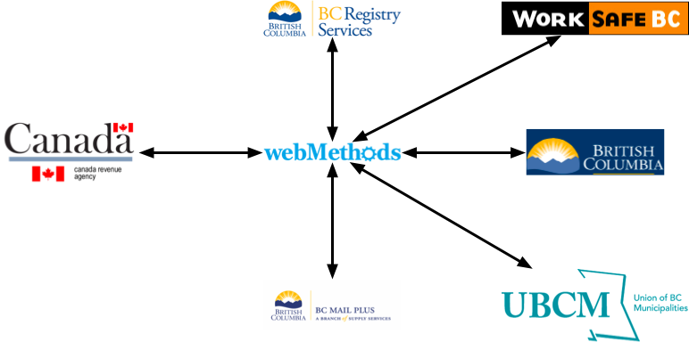

- Start Date: 2021-10-07
- Target Major Version: 
- Reference Issues: bcgov/entities#9426 
- Entity Issue: [bcgov/entities#9426](https://github.com/bcgov/entity/issues/9426)
- Implementation PR: (leave this empty)

# Summary
The **BC BN Hub** (Hub), at its core, provides a service to manage and maintain _Business Numbers_ (BN) for BC businesses.

- A business number (BN) is a _nine-digit number_ assigned by the Canada Revenue Agency (CRA) as a tax ID.
- A BN is also used as part of _15-digit CRA program account number_ used when reporting on certain activities such as GST, employee payroll, etc.
- BC is one of six provinces that have adopted the use of CRA BNs.

A BN program account has the following composition.

The Hub currently provides three main services:
- Manage the BN and business data between the Registry and the CRA
- Sharing BN and business data between the Registry and its partners
- Inter-partner sharing of business data

The BC Registry (Registry) uses the HUB to request BNs on behalf of the businesses in its registry, and to share the BN and business info with its partners in the province.

Over time the Hub was also used by partners to share business related data between themselves. There are more partners than shown in diagram, which contains just a representative sample. In general the Registry does not use partner information to update its records, as it is the legal system of record for businesses in BC.

# Motivation

The BC Registry is upgrading all of its systems and business processes as part of its modernization project. The current BNHub leverages an old government standard using the WebMethods messaging and integration service that needs to be replaced.

The opportunity of needing to replace WebMethods also allows the Registry to re-examine the services it provides.

# Design Options
The design approaches below are intended to cover the 3 main business services provided by the existing BNHub.

### Registry and CRA data exchange
The Registry should verify that there are no new options available to connect with the CRA.
The existing CRA connections, described in more detail in _docs/bcbnhub/decommssion.md_ will be replaced by a new SOAP submitter/listener that will place incoming messages onto the Registry Queue service in the standard CloudEvent format.

### Registry data sharing with partners
The Registry will undertake a review of the types of interactions that various partners require to meet their business objectives. There are three broad offerings that exist, or can be built out to meet the following business interactions.
#### Non-data sharing and publicly available data
Clients in this category, they will leverage the OrgBook services.
#### Protected data accessed based on external events
Clients in this category will create Registry accounts, and leverage the Registry API services. For on-going tracking of a particular business, an OAS 3.1 call-back can be registered.
#### Protected, data changed for any business
Clients in this category will create Registry Accounts and use Ed25519 signed JWTs to access the Registry partner queue channel.

### Inter-Partner data sharing
A decision request will be presented to the Registrar to determine if the Registry will build a new service to cover this non-core business service. Depending on the outcome of that _decision request_, an RFC dedicated to that solution will be created.

# Drawbacks

The existing BNHub meets the current business needs. It is the technical components of the service that are end-of-life and need investment to maintain the status-quo.

Replacing systems that partners use to gain access to Registry data will require investment on their behalf to make the required changes.

# Alternatives

Adopting the current technologies and processes that Registry is using in its new development standards will provide the largest return on investment.

Maintaining the current environment is not possible without further investment in tools and services that are not part of the new Registry will continue to require higher levels of investment in time, and skills by the SRE team.

# Adoption strategy

The Registry will:
- Contact the CRA to determine if there are newer, or planned changes in the federal BN offering.
- Partner engagement to determine the best option for partners leveraging the Registry OCM and BA teams.
- Complete the _decision request_ paper and executive review by ______

# Thanks

This template is heavily based on the Vue, Golang, React, and other RFC templates. Thanks to those groups for allowing us to stand on their shoulders.
