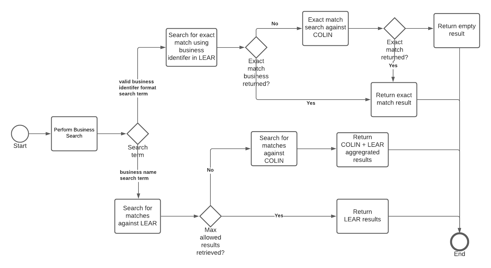
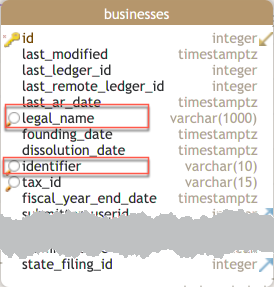
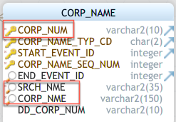

- Start Date: 2022-02-07
- Target Major Version:
- Reference Issues: [9261](https://github.com/bcgov/entity/issues/9261)
- Entity Issue:

# Summary
This RFC provides backend design details for implementing business look up functionality as well as potential front end 
implementation options.

A list of the main points to summarize the discoveries, recommendations and design decisions made in this RFC include:
* BE business lookup search will consist of a single legal api business lookup endpoint which the UI will invoke.  This 
  endpoint will serve as a proxy to a COLIN API endpoint to retrieve matching COLIN businesses where required.
* Inline search(option 4 in UI section) is recommended for UI implementation
* Detailed performance analysis seems to indicate that even with fairly un-optimized test POC endpoint, aggressive test 
  parameters and weak(locally hosted) resources for apis/databases, results could be returned within a second for result set sizes of up 
  to 100. 

# Motivation
To determine the implementation approach for the backend business lookup functionality and to provide guidance on what 
front end implementation options are available for business lookup when submitting registrations via Create-UI.

# Performance Analysis
In order to gain insight as to what implementations were possible for the business look up functionality, performance 
analysis was done using the performance testing/analysis tool, jMeter.  jMeter was specifically used to invoke a minimal
implementation of a POC legal api endpoint that aggregates matching business lookup results from the COLIN/LEAR databases.

The size of the business lookup datasets used for the performance tests in COLIN/LEAR databases were similar to the 
production sizes.

The performance tests were executed from a developer machine in which all APIs and databases of interest were also 
hosted.  This means that we are likely achieve better performance if the tests were run against an environment that was
closer to a production environment where each API and database was running in its own dedicated container and had a 
fixed set of resources to consume.

The following table provides performance analysis results for a scenario simulating 10 users hitting the POC legal api 
endpoint each 50 times.  Each row in the table represents the results from users hitting a legal api endpoint that 
returns a specific number of search results.  In order to simulate a more real world scenario, users did not start 
hitting the endpoint simultaneously but instead, an additional user was brought on at ten second intervals. 

| # Results<br>Returned | Available<br>Results | # <br>Samples | Connection<br>Speed | Avg<br>(ms) | Min<br>(ms) | Max<br>(ms) | Bytes<br>Returned |
|----------------|----------------------|---------------|---------------------|-------------|-------------|-------------|-------------------|
| 25             | 542                  | 1500          | 10 Mbits/s          | 810         | 588         | 2445        | 2624              |
| 50             | 542                  | 1500          | 10 Mbits/s          | 992         | 622         | 2676        | 4747              |
| 100            | 542                  | 1500          | 10 Mbits/s          | 1034        | 665         | 2820        | 8917              |
| 250            | 542                  | 1500          | 10 Mbits/s          | 1692        | 863         | 3257        | 21625             |
| 542            | 542                  | 1500          | 10 Mbits/s          | 2483        | 1123        | 4266        | 46143             |

In general, the results indicate that even given the unfavourable conditions of running everything on a developer 
machine, a minimal un-optimized POC legal/colin api endpoints and aggressive jMetric test parameters, result sizes up to
100 were able to return within a second.  It is expected that the final implementation running in a production environment 
would be more performant.


# Detailed design

The overall design for the backend for the business look up functionality consists of creating a legal and COLIN api 
endpoint which queries the LEAR/COLIN databases for business data based on the provided search term by the api consumer.
The initial endpoint invocation from the FE will go through the legal api which will serve as a proxy to the COLIN API 
in cases where results need to be retrieved and aggregated from the COLIN API.

Max results returned should be a configurable value in the legal/colin api.  The legal api business lookup endpoint will
use this value to determine whether the COLIN endpoint needs to be invoked to retrieve additional business lookup data. 
Having this value configurable will also make it easier to tweak our APIs based off of the response times we see in the 
production environment.

### Business Lookup Flow
The following flow diagram provides an overview of the businesses lookup logic flow for the backend. 


### LEAR Business Lookup
The business lookup for the LEAR database will involve writing queries that look at the `legal_name` and `identifier` 
columns of the `businesses` table depending on the incoming search term.  Note: should consider adding a column like `srch_nme` column found in 
COLIN `corp_name` table.


### COLIN Business Lookup
The business lookup for the COLIN database will involve writing queries that look at the `corp_num`, `srch_nme` and 
`corp_nme` columns of the `CORP_NAME` table depending on the incoming search term.  



### Response Payload Formats
The different scenarios supported by the legal api business lookup endpoint will have response payloads in the formats 
as per the examples provided below.

#### Example endpoint invocation
```
GET {{legal-api-base-url}}/businesses?searchTerm=kits
```

#### Exact Match Response
``` json
{
  "results": [
    {
      "identifier": "CP0001111",
      "legal_name": "KITS1 CO-OPERATIVE HOUSING ASSOCIATION"
    }
  ],
  "isExactMatch": true,
  "resultsCount": 1,
  "totalCount": 1
}
```

#### All Results Response
``` json
{
  "results": [
    {
      "identifier": "CP0001111",
      "legal_name": "KITS1 CO-OPERATIVE HOUSING ASSOCIATION"
    },
    {
      "identifier": "CP0002222",
      "legal_name": "KITS THINGERY CO-OPERATIVE (BRANCH 2)"
    }
  ],
  "isExactMatch": false,
  "resultsCount": 2,
  "totalCount": 2
}
```

#### Subset of Total Results Response
``` json
{
  "results": [
    {
      "identifier": "CP0001111",
      "legal_name": "KITS1 CO-OPERATIVE HOUSING ASSOCIATION"
    },
    {
      "identifier": "CP0002222",
      "legal_name": "KITS THINGERY CO-OPERATIVE (BRANCH 2)"
    },
	...
  ],
  "isExactMatch": false,
  "resultsCount": 5,
  "totalCount": 542
}
```

#### No Matching Results Response
``` json
{
  "results": [],
  "isExactMatch": false,
  "resultsCount": 0,
  "totalCount": 0
}
```

### Misc
* Endpoint should only be available to authenticated and authorized users
* The `SRCH_NME` column of `CORP_NAMES` table in COLIN database is quite useful.  This should be potentially added to 
  the `businesses` table in the LEAR database.
* Paging was not considered to reduce complexity.  Even if paging was eventually introduced it would probably make sense
  to introduce it after we decommission COLIN
* Caching was considered but given that searches are likely fairly different across users, a cache may not help much
  when most searches are cache misses

# UI Options

| Option # | Description                                                                                                                                                                      | Notes                                                        |
|----------|----------------------------------------------------------------------------------------------------------------------------------------------------------------------------------|--------------------------------------------------------------|
| 1        | Drop down with type ahead                                                                                                                                                        | <ul><li>require a least 3 characters before legal api search endpoint should be invoked</li><li>debounce to around 1 second to limit sub-second endpoint invocations</li><li>result set per endpoint invocation should be 25-100 results</li><li>based off of performance analysis, BE will likely be performant enough to support type ahead functionality</li><li>check response payload for exact match flag </li></ul> |
| 2        | Drop down with no type ahead                                                                                                                                                     | <ul><li>full search term required per search</li><li>drop down displays capped results of 25-100 results</li><li>use response payload to determine whether to inform user to refine search as there are more results avaialable</li><li>check response payload for exact match flag</li></ul> |
| 3        | Modal search                                                                                                                                                                     | <ul><li>full search term required per search that opens a modal with search results</li><li>modal displays between max result between 250-500 depending on performance in production environment</li><li>use some kind of button to re-open modal with same search results </li><li>may require loading indicator if we use higher max result</li><li>use response payload to determine whether to inform user to refine search as there are more results available</li><li>check response payload for exact match flag</li></ul> |
| 4        | Inline search <br><br> Note: this will be similar to the modal search.  there will just be no need to have logic to re-open search results as it will always be displayed inline | <ul><li>full search term required per search that opens a modal with search results</li><li>max result between 250-500 depending on performance in production environment</li><li>may require loading indicator if we use higher max result</li><li>use response payload to determine whether to inform user to refine search as there are more results available</li><li>check response payload for exact match flag</li></ul> |
| 5        | Search with paging                                                                                                                                                               | <ul><li>not considered as this introduces too much complexity for the FE and BE at this point</li></ul> |

# Drawbacks
The addition of an endpoint to COLIN API is likely not as efficient as querying the COLIN database directly from the 
Legal API business look up endpoint.  But based off of the results from the performance analysis, it is still relatively
performant.  This approach of having a separate COLIN API endpoint for the business lookup will make it easier to remove
COLIN specific code from the legal api business lookup endpoint when it comes time to decommission COLIN.  i.e.  We will 
mostly need to just remove the COLIN API url configuration and some code used to retrieve and aggregate COLIN API business 
lookup results.

# Adoption strategy
Implement the backend as per the designed details.  Once all the COLIN database can be decommissioned, remove code
required to query COLIN businesses which should make the business look up more performant.

With respect to the UI, available implementation options are essentially options 1-4 defined in the UI Options section. 
The decision of which UI option to implement will ultimately reside with UX and FE subject matter experts but options 4 
may be a good option.   

Although the type ahead search UI implementation(option 1) is not recommended for the businesses lookup, given the 
performance test results, it is likely that this is possible and would be performant enough even with several users 
hitting the endpoint with relative frequency.  It is however recommended that this be done later as it introduces quite 
a bit of complexity to the front end.  It is also ideal that this be introduced after COLIN can be decommissioned at 
which point the business lookup endpoint should be even more performant.

# Unresolved questions
None

