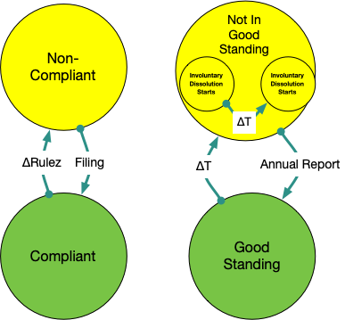

- Start Date: 2021-12-03
- Target Major Version: 
- Reference Issues: [10098](https://github.com/bcgov/entity/issues/10098)
- Entity Issue: [8285](https://github.com/bcgov/entity/issues/8285)
- Implementation PR: (leave this empty)

# Summary

A businesses state provides information on what actions and transitions are allowed.
While _active_ a business also has a set of actions that affect its compliance, which can also limit available actions.

# Basic design

A business has a limited number of states that it can be in, as shown in the below state diagram.
A business transitions through states either by submitted _filings_, missed _filings_ to maintain compliance, or is administratively _suspended_.

A business is created through some _bootstrap_ filing to create an **Active** Business.
A business can become **Historical** by any _dissolution_, _liquidation_ or _amalgamation_ filing. A historical business can be restored and made active, unless it was made historical by a filing that placed it in a **Non-Restorable** state.

## Active business states

An active business can have several compliance and conformance states.
These states are treated as a set of _warning_ states, some of which track a flow that leads to a _filing_ that can make the business historical.

The below diagram shows _compliance_ and _good standing_.
A company can become non-compliant through filings that place it in contravention of it's legal structural requirements.
An example of that would be a Co-Op with no directors.
A company transitions to _not in good standing_ by failure to file its annual report. If too many annual reports are missed, a dissolution filing will be initiated.

# Detailed design

The filing structure held in the meta class should be extended to define any state it transitions a business into.

The same structure, or a new one, should be created to define what business type, state and filings are allowed.

Every business type, should have a structural conformance array covering addresses, shares, parties, etc.

Every business should have a set of steps from _good standing_ to finally being a candidate for an _involuntary dissolution filing_.

The business class also needs an administrative _freeze_ that blocks any new filing until the freeze is removed. Staff should still be able to change non-structural data,such as comments on the business or filings.

Like used in NameX there should be a set on Enums and constraint tables that match and maintain consistency of the values assigned to the business class.

The JSONSchema will be extended to cover:
- good standing: true, or the step towards dissolution.
- compliant: struct of all the applicable warnings
- state: active | historical | liquidation_flow

**Decision required**
The business class gets generated into a database table. The business table can be constrained by _lookup tables_ or by SQL Enums that can be generated from the Python Enums defined with the Business.
The Registry legacy systems use constraint tables.
Using constraint tables will require tests like in NameX to ensure the Enums and constraint tables match.

Regardless of choice, the database migration process should change to ensure that global table locks are not created, or held only for a short period of time, such that deployments do not cause disruption or access outages.

# Adoption strategy

The _lear_ team will create a story to implement the required components.

# Unresolved questions

Not every business type, state, or transition are covered in detail here.
The general design should be extensible to easily accommodate new workflows, filings and informational states.

# Thanks

This template is heavily based on the Vue, Golang, React, and other RFC templates. Thanks to those groups for allowing us to stand on their shoulders.
