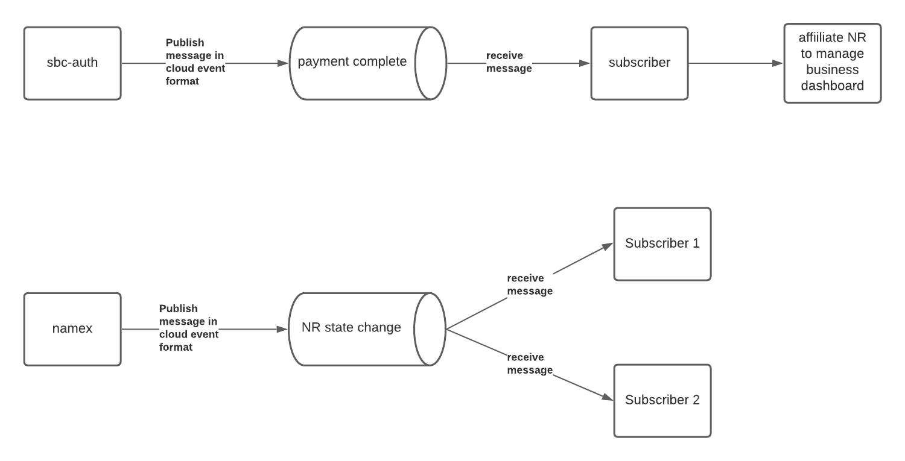

- Start Date: 2021-06-21
- Target Major Version:
- Reference Issues: n/a
- Entity Issue: https://github.com/bcgov/entity/issues/7975
- Implementation PR: (leave this empty)

# Summary

Name Request will publish messages using the CloudEvent standard to a queue when a NR has been paid for or when a
state change occurs for a NR.  The events will be published to a specific subject and relevant
applications/services will be able to subscribe to the subject, consuming the events as required.

_Note: the CloudEvent format is already being used by the names pay service when publishing to the entity emailer queue.
As such, some of the queue common code can be leveraged during implementation._

# Basic example

Example CloudEvent format currently being used by names pay service to publish a message to the entity emailer queue.

``` json

        {
            "specversion": "1.x-wip",
            "type": "bc.registry.names.request",
            "source": "nr_pay",
            "id": "16fd2706-8baf-433b-82eb-8c7fada847da",
            "time": "",
            "datacontenttype": "application/json",
            "identifier": "781020202",
            "data": {
                "header": {"nrNum": "781020202"},
                "paymentToken": "234234234324asjdkfhjsdhf23949239423",
                "statusCode": "PAID"
            }
        }

```

###Code snippets from names pay service's CloudEvent implementation:

``` python

def create_cloud_event_msg(msg_id, msg_type, source, time, identifier, json_data_body):  # pylint: disable=too-many-arguments # noqa E501
    # industry standard arguments for this message
    """Create a payload for the email service."""
    
    cloud_event_msg = {
        'specversion': '1.x-wip',
        'type': msg_type,
        'source': source,
        'id': msg_id,
        'time': time,
        'datacontenttype': 'application/json',
        'identifier': identifier
    }
    
    if json_data_body:
      cloud_event_msg['data'] = json_data_body

    return cloud_event_msg
    
```


``` python
   
    nr = RequestDAO.find_by_id(payment.nrId)
    cloud_event_msg = create_cloud_event_msg(msg_id=str(uuid.uuid4()),
                                             msg_type='bc.registry.names.request',
                                             source=f'/requests/{nr.nrNum}',
                                             time=datetime.
                                             utcfromtimestamp(time.time()).
                                             replace(tzinfo=timezone.utc).
                                             isoformat(),
                                             identifier=nr.nrNum,
                                             json_data_body={
                                                 'request': {
                                                     'header': {'nrNum': nr.nrNum},
                                                     'paymentToken': payment.payment_token,
                                                     'statusCode': nr.stateCd
                                                 }}
                                             )
    
    await publish_email_message(qsm, cloud_event_msg)
```

# Motivation

Implementing an event driven architecture through the use of queues allows us to decouple services and
reduce the likelihood of a single point of failure.  This architecture is also highly scaleable both from
the perpsective that there is no need for point to point integration and that it is very easy
to integrate new services that need to consume a certain type of message in an adhoc manner.

In addition, the CloudEvent standard will provide a common messaging format that all developers can
reference when implementing queue related logic for producing and consuming messages.


# CloudEvent Attributes Usage (WIP)

This section is intended to provide a general set of guidelines as to how the attributes of the CloudEvent payload should
be used within the context of the development teams at BC Registries.  As such, this section will not contain an 
exhaustive description of CloudEvent attributes.  For more details of CloudEvent attributes, please refer to the 
CloudEvents specification as provided in the references section of this document.


| Attribute Name  | Attribute Type | Data Type     | Example Value                        | Required | Notes      |
|-----------------|----------------|---------------|--------------------------------------|----------|------------|
| specversion     | context        | string        | 1.0.1                                | Y        |            |
| source          | context        | URI-reference | /sbc_pay_api/invoice/<INVOICE_ID>    | Y        |            |
| id              | context        | string        | 16fd2706-8baf-433b-82eb-8c7fada847da | Y        | use uuidv4 |
| type            | context        | string        | bc.registry.nr_payment.complete      | Y        |            |
| datacontenttype | context        | string        | application/json                     | N        |            |
| time            | context        | timestamp     |                                      | N        |            |
| identifier      | custom         |               |                                      | N        |            |
| data            | data           |               | json data                            | N        |            |


_**Additional details will go here to go over attributes that require my explanation around the nuances of how we use the
attributes in our CloudEvent payloads**_


# Detailed design

The diagram below provides the flows that will need to be updated to support our CloudEvent implementation.  Specifically,
the integration points are the areas where work will need to be done.




## Integration Point Details
The following section details the expected formats of the CloudEvent payloads that need to be used at each integration point
outlined in the CloudEvents Diagram above and any specific design details for the specific integration point.

For details around the intended usage of the CloudEvent payload attributes, refer to the CloudEvent attribute usage section below.

### Integration Point 1 - NR Payment Complete CloudEvent (WIP)
The event at this integration point has already been implemented but will need to be updated to match the CloudEvent format below.  Updates will need to be made in the `PaymentTransaction.create_event_payload` function.

**Current Implementation**
``` python 

@staticmethod
def create_event_payload(invoice, status_code):
    """Create event payload for payment events."""
    payload = {
        'paymentToken': {
            'id': invoice.id,
            'statusCode': status_code,
            'filingIdentifier': invoice.filing_id
        }
    }
    return payload

```


**CloudEvent Payload Format**

``` json

        {
            "specversion": "1.0.1",
            "type": "bc.registry.nr_payment.complete",
            "source": "/sbc_pay_api/invoice/<INVOICE_ID>",
            "id": "16fd2706-8baf-433b-82eb-8c7fada847da",
            "time": "<PUBLISH_TIME>",
            "datacontenttype": "application/json",
            "identifier": "<FILING_ID>",
            "data": {
                "invoiceId": "<INVOICE_ID>"
				   "filingId": "333333",
            }
        }

```


### Integration Point 2 - SBC Auth Subscriber & Affiliate NR to Manage Business Dashboard (WIP)

At this integration point, the sbc-auth subscriber/listener will need to be updated to subscribe for the CloudEvent
defined in integration point 1.  It will need to be able to parse the context and data attributes of the CloudEvent and 
code to affiliate NR manage business dashboard will also need to be written.


### Integration Point 3 - Publish NR State Change CloudEvent (WIP)

The names-api will need to be updated such that any point where a state change occurs for an NR, a CloudEvent similar 
to the one below is sent to the queue.  


``` json

        {
            "specversion": "1.0.1",
            "type": "bc.registry.nr_state.changed",
            "source": "/namex_api/nr/6724165",
            "id": "16fd2706-8baf-433b-82eb-8c7fada847da",
            "time": "PUBLISH_TIME",
            "datacontenttype": "application/json",
            "identifier": "6724165",
            "data": {
                "nrNum": "6724165",
                "previousState": "DRAFT"
                "newState": "PAID"
            }
        }

```


# Drawbacks

Event publishing or consumption may not happen in a timely enough matter in particular scenarios.

May be difficult to debug errors when trying to trace the publishing and consumption of messages.  Particularly in
scenarios where there are a lot of messages being published and consumed.

_Note:  We are moving to implement spans across our queues which will allow tracebility through a common
context.  Implementation of this feature is possible once our queue infrastructure has been upgraded to a version
that supports spans._


# Alternatives

Expose endpoints for services/applications to poll for relevant information or integrate directly with other services
through api calls in instances where information needs to be pushed to other applications.


# Adoption strategy

Should be straightforward as we can reference names-pay and queues are already used in a lot of places.  As well,
as the use of queues is already a loosely coupled approach(i.e. consumers and producers don't know about each other),
the introduction of new messages and consumption of new messages should have minimal effects on other services and components.

# Unresolved questions

None


# References

[CloudEvents - Version 1.0.1 Specification](https://github.com/cloudevents/spec/blob/v1.0.1/spec.md)


