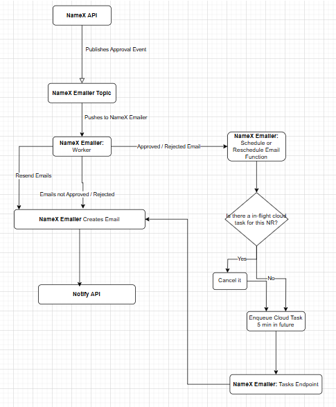
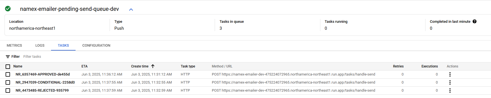

- Start Date: 2025-06-03
- Entity Issue: [bcgov/entity#21835](https://github.com/bcgov/entity/issues/21835)
- Implementation PR: https://github.com/bcgov/namex/pull/1820

# Summary

The Names Team will integrate [**_GCP Cloud Tasks_**](https://cloud.google.com/tasks/docs) into the namex emailer to introduce a 5-minute grace period for approval, conditional, and rejection emails. Rather than sending every decision immediately, the emailer worker will:

1. Cancel any existing Cloud Task for that NR.
2. Enqueue a new task, scheduled for 5 minutes in the future, containing the latest decision (NR number & option).

If a new decision arrives within five minutes, the previous task is revoked and replaced. Only when no further decision arrives for five minutes will the Cloud Task "survive" and invoke the namex emailer `/handle-send` endpoint and send the email. This prevents sending multiple emails if an examiner changes their mind quickly.

All other email types (initial notifications, consent letters, resends) continue to send immediately; only `APPROVED`, `CONDITIONAL`, and `REJECTED` decisions (excluding resends) follow this cloud tasks async flow.

# Basic Example

1. Name Examiner approves `NR 1234567` at 2:00 pm.  
2. Namex API publishes an "Approved" CE (Cloud Event) to Emailer Topic, and Emailer Worker picks it up.  
3. Worker sees the `APPROVED` option, deletes any existing task for that NR number, and creates a new Cloud Task:
   - **Name**: `NR_1234567-APPROVED-{random-6-digits}`  
   - **Schedule time**: 2:00 pm + 5 min = 2:05 pm  
   - **HTTP push**: POST `https://<namex_emailer>/tasks/handle-send`  
   - **Body**: Includes NR-Number and Option
4. At 2:02 pm, the examiner changes to "Conditional": Namex API publishes a "Conditional" CE.  
5. Worker revokes `NR_1234567-APPROVED-{random-6-digits}`, then enqueues a new task with the “Conditional” payload scheduled for 2:07 pm called `NR_1234567-CONDITIONAL-{random-6-digits}`
6. No new events for `NR 1234567` arrive between 2:02 pm and 2:07 pm.  
7. At 2:07 pm, Cloud Tasks POSTs the "Conditional" CE to `/tasks/handle-send`.  
8. The `handle-send` handler builds and sends the conditional email; the client receives only that one email.

Note: The `{random-6-digits}` in the task name is a short hex UUID to ensure uniqueness. Cloud Tasks does not allow a task name to be reused for at least one hour after completion or deletion. This suffix prevents name collisions during rapid rescheduling - `NR_123_APPROVED_4hd231` and `NR_123_APPROVED_h3d987` won’t conflict, even if the same option is scheduled multiple times for the same NR.

# Motivation

To stop clients from getting spammed with emails when examiners make mistakes and change their minds in a quick succession. Without an external service like cloud tasks the Namex Emailer runs as a Flask WSGI service, so each request is handled synchronously by a single Gunicorn worker. Once a worker starts processing an incoming cloud event, it must finish that entire request before picking up the next one. There is no built-in mechanism to pause, delay, or maintain state between separate HTTP calls. As a result, we cannot implement a _"wait 5 minutes for a final decision"_ pattern purely within the existing WSGI request flow. By adding GCP Cloud Tasks as an external scheduler, we can offload the delay logic to a managed, cancelable queue. This allows us to "debounce" approval/conditional/rejection events without relying on in-process threads or long-running connections.

# Detailed Design

### High Level Flow



### Cloud Tasks Example Payload
```json
{
  "data": {
    "request": {
      "nrNum": "NR 6357469",
      "option": "APPROVED"
    }
  },
  "datacontenttype": "application/json",
  "id": "5ad47886-17c5-424f-9049-b1bca314d497",
  "source": "/requests/NR 6357469",
  "specversion": "1.0",
  "subject": "namerequest",
  "time": "2025-06-03T18:31:11.618490+00:00",
  "type": "bc.registry.names.request"
}
```

### Example of tasks on cloud tasks queue


# Requirements List

- **Must Have:**  
  - Debounce APPROVED, CONDITIONAL, and REJECTED emails via Cloud Tasks.  
  - Immediate delivery for all other email types (notifications, consent letters, resends).  
  - Dedicated Cloud Tasks queue with proper retry configuration.  
  - `/handle-send` endpoint in the emailer to process Cloud Tasks callbacks.  
  - Emailer service account granted `cloudtasks.tasks.list`, `cloudtasks.tasks.create`, and `cloudtasks.tasks.delete`; Cloud Tasks allowed to invoke `/handle-send`.  
  - Idempotency cache (ce_cache) to skip duplicate CEs.  

- **Should Have:**  
  - End-to-end tests validating task scheduling, cancellation, and final send.  
  - Monitoring and alerts on Cloud Tasks failures.  
  - Logs for task creation, cancellation, and `/handle-send` execution.  
  - Error handling in `/handle-send` that returns non-200 to trigger Cloud Tasks retries.  

- **Could Have:**  
  - Feature flag to toggle debounce logic on or off.  
  - Configurable debounce interval via environment variable.  

- **Won’t Have:**  
  - Debounce for non-decision or resend Cloud Events - they send immediately.  
  - Multi-region or fallback queue support (single queue only).  
  - Custom retry logic beyond Cloud Tasks’ built-in policy.  
  - Tracking or listing of failed sends.  

# Drawbacks

1. Increased complexity and additional infrastructure
   - Introducing Cloud Tasks adds a new GCP component to manage: queue setup, IAM roles, retry policies, etc. Developers and operators must become familiar with Cloud Tasks (console, CLI, logs) in addition to Pub/Sub and the existing emailer code.

2. Expanded IAM and security scope
   - The emailer’s service account now requires new Cloud Tasks permissions (`cloudtasks.tasks.list`, `cloudtasks.tasks.create`, and `cloudtasks.tasks.delete`).
   - Cloud Tasks also needs permission to invoke the emailers `/handle-send` endpoint, meaning we must configure a service account or OIDC token for secure task execution.

3. Dual‐endpoint responsibilities in the emailer
   - The emailer is no longer just a Pub/Sub consumer; it must also accept incoming HTTP requests from Cloud Tasks. This means adding and maintaining a second route (/handle-send) and handling two different invocation sources.

4. Cost considerations
   - Adding a new google cloud service will come with an additional cost. Although the payload is minimal in each cloud task (just NR number and option), it will inevitably increase the monthly cloud bill for bcgov. 

5. No debounce on decision --> reset only flows
   - If an NR is approved, then immediately reset and no new decision follows, the originally scheduled email still sends—because reset events don’t go through the emailer.
   - This matches the current behavior, though we could adjust code to route reset events through the debounce logic if needed.

# Alternatives

1. **Use a database table + periodic sweep job**

   **Logic**
   - When an Approved, Conditional, or Rejected CE (Cloud Event) arrives, write (or overwrite) a row in a new `email_debounce` table keyed by NR number and event type.
   - A scheduled job runs every 5 minutes. It queries the table for any NR whose latest CE is at least 5 minutes old, sends the corresponding email, and deletes that row.  

   **Pros**
   - Simple and easy to reason about; avoids introducing new cloud services.
   - No need for async infrastructure - can be implemented with a cron job.

   **Cons**
   - Polling-based, so emails may be delayed up to 10 minutes depending on job alignment.
   - Requires creating a new job that runs frequently, which could increase operational complexity and cost.
   - Requires a new `email_debounce` table in the Namex DB, and the emailer service currently has no DB connection - this would need to be added.

2. **Chain into a second Pub/Sub topic**

   **Logic**
   - When a decision CE arrives, the emailer republishes it to a dedicated "debounce" Pub/Sub topic, overwriting any existing message for that NR.
   - An async subscriber listens to this topic, waits 5 minutes (e.g., via `time.sleep`), and then sends the email.
   - If a newer message for the same NR arrives during the wait, the subscriber drops the older one and resets the timer.

   **Pros**
   - Reuses existing Pub/Sub-based patterns already common within BCGov.
   - All asynchronous logic is isolated in a dedicated service, separate from the core emailer.

   **Cons**
   - Effectively introduces a Pub/Sub → Pub/Sub chain, which increases complexity and likely results in duplicate code between services.
   - Requires provisioning both a new Pub/Sub topic and a separate service to handle delayed processing.

3. **Use Cloud Scheduler (GCP Scheduler API) to schedule a publish to the Pub/Sub topic**

   **Logic**
   - When a decision is made in Namex API, instead of publishing directly to the emailer topic, it creates a one-time scheduled job that will publish to the emailer topic after a delay.
   - If another decision occurs within the 5-minute window, the existing scheduled job is deleted and replaced (from the API) with a new one containing the updated payload.
   - When the delay expires, Cloud Scheduler publishes the message to the emailer topic. The emailer worker picks it up and processes it as usual.
   - The emailer deletes the scheduled job after processing to prevent a buildup of leftover scheduled jobs (this is the only change needed in the emailer).

   **Pros**
   - Very limited changes to the emailer, it only needs to delete the job after processing.
   - Cancellation and rescheduling are straightforward using predictable job names.
   - Scheduler jobs are visible and traceable in the GCP console or CLI.
   - Cloud Scheduler is already used in other BCGov services, so this approach wouldn’t introduce a new technology.

   **Cons**
   - Requires managing job names and deletion logic to prevent conflicts.
   - Cloud Scheduler jobs do not automatically delete themselves like Cloud Tasks, so an extra step is required to identify and remove the job after it completes.
   - Cloud Scheduler jobs appear individually in the GCP Console under the Scheduler Jobs page, and they are not grouped, which can make management and tracking more cluttered compared to Cloud Tasks.


# Adoption Strategy

Deploy the Cloud Tasks changes to the Dev and Test environments, and verify that the queue functions correctly under thorough monitoring. Once validated, create the production Cloud Tasks queue, grant the necessary permissions, and deploy the changes to production for release.

# Unresolved Questions

None
