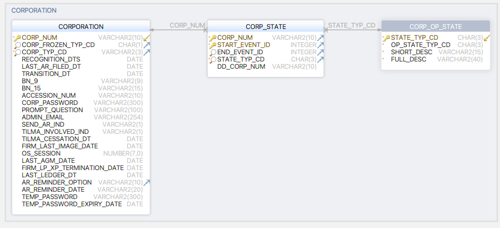
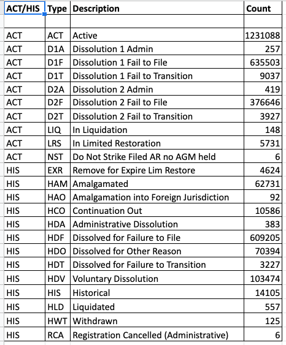
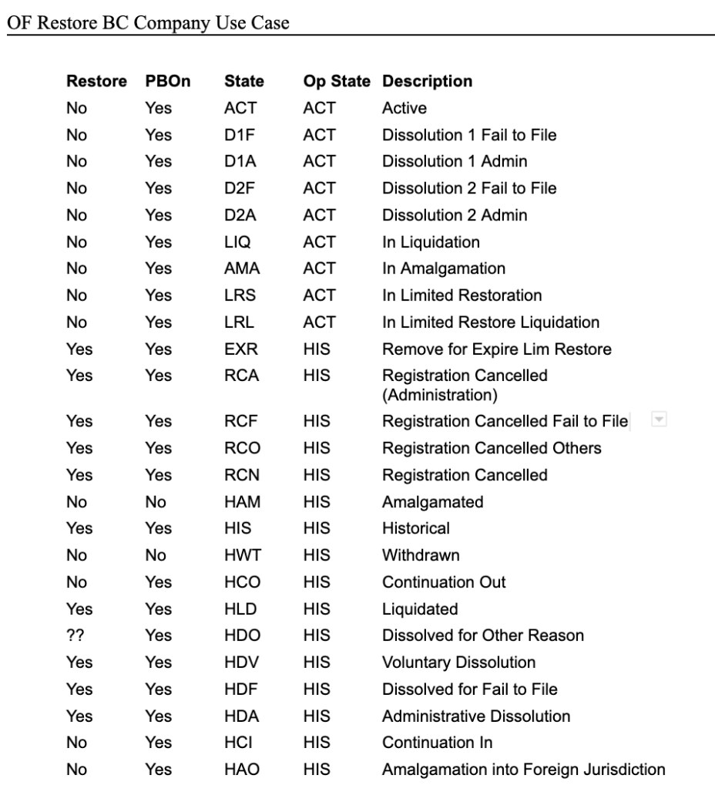

- Start Date: 2021-12-03
- Target Major Version: 
- Reference Issues: [10098](https://github.com/bcgov/entity/issues/4797)
- Entity Issue: [8285](https://github.com/bcgov/entity/issues/14691)
- Implementation PR: (leave this empty)

# Summary

COLIN represents a business state as two states which are referred to as an operational state(`CORP_OP_STATE` table) and a corp state(`CORP_STATE`) table.  In many instances, these two states are used in conjunction to drive business logic and to determine allowable business state transitions between `ACTIVE` and `HISTORICAL` states for a given business.

LEAR will not be adopting the COLIN approach of using the `CORP_STATE` table.  

This RFC will provide design details as to how LEAR will achieve the same functionality as COLIN without the use of the `CORP_STATE` table.

Note that the [Business States RFC](rfc-business-states.md) as well the current implementation of the Legal API was used as a starting point for the creation of this document.

#### COLIN Database Structure for Business States


#### Current Corp State Data in CPRD
_`ACT/HIS` column is `CORP_OP_STATE` table._
_`Type` column is `CORP_STATE` table._



# Basic design

The COLIN business states can be mapped 1-1 to the business states(`businesses.state`) in LEAR.  Only `ACTIVE` and `HISTORICAL` are valid business states.

The `CORP_STATE` table in COLIN will not be used. It was essentially used track the latest filing a business had filed and not an actual state.  This functionality will be achieved in LEAR by using a combination of the filing type, dynamic calculations (warning structures or business properties like good standing) or using the filing type that transitioned a business into its current state.

Compliance is informational only and does not block any registry actions but must be noted to viewers of the Registry.

Good standing has various statuses and can lead to a business state transition.

`Liquidation` is not a business state.  It will consist of a series of flow statuses similar to how _good standing_ works, eventually transitioning a business into a `historical` state.

Flows like `good standing`, `liquidation`, `involuntary dissolution` will make use of existing business warnings structure to keep track of flow statuses.

A periodic job(s) will run to analyze flow statuses and transition business state and do things like initiate a dissolution filing where required.

# Detailed design

Business GET endpoint will return an `allowableActions` property containing allowed “filing” actions.

The allowable filings will be determined using a combination of the allowable filing transitions map, [logic in the FE](https://github.com/bcgov/business-filings-ui/blob/main/src/mixins/allowable-actions-mixin.ts) that needs to be implemented in the BE, filtering by account + feature flags and any other required logic.

As examples, a non-registry staff account would not be able to see a `putBackOn` filing and some groups may have access to a filing like `amalgamations` by feature flag.

The `allowableActions` property can also be extended in the future to support things like “admin” actions.


_Examples of what this might look like_
``` http response

GET https://legal-api-dev.apps.silver.devops.gov.bc.ca/api/v2/businesses/BC0001199

{
    "business": {
        "legalName": "XYZ TEST CORP.",
        "legalType": "BC",
        "state": "HISTORICAL",
        "allowableActions": {
            "admin": {
                "addDetailCommentLink": "https://legal-api-dev.apps.silver.devops.gov.bc.ca/api/v2/businesses/BC0871274/filings/{filing_id}/comments",
                "addStaffCommentLink": "https://legal-api-dev.apps.silver.devops.gov.bc.ca/api/v2/businesses/BC0871274/comments",
                "actionTypes": [
                    {
                        "name": "addDetailComment",
                        "displayName": "Add Staff Detail Comment"
                    },
                    {
                        "name": "addStaffComment",
                        "displayName": "Add Staff Comment to Business"
                    }
                ]
            },
            "filing": {
                "filingSubmissionLink": "https://legal-api-dev.apps.silver.devops.gov.bc.ca/api/v2/businesses/BC0871274/filings",
                "filingTypes": [
                    {
                        "name": "restoration",
                        "type": "fullRestoration",
                        "displayName": "Full Restoration",
                        "feeCode": "RESTF"
                    },
                    {
                        "name": "restoration",
                        "type": "fullRestoration",
                        "displayName": "Limited Restoration",
                        "feeCode": "RESTL"
                    },
                    {
                        "name": "putBackOn",
                        "displayName": "Put Back On",
                        "feeCode": "NOFEE"
                    },
                    ...
                ]
            }
        },
        ...
    }
}
```

``` http response

GET https://legal-api-dev.apps.silver.devops.gov.bc.ca/api/v2/businesses/BC0001199

{
    "business": {
        "legalName": "XYZ TEST CORP.",
        "legalType": "BC",
        "state": "ACTIVE",
        "allowableActions": {
            "admin": {
                "addDetailCommentLink": "https://legal-api-dev.apps.silver.devops.gov.bc.ca/api/v2/businesses/BC0871274/filings/{filing_id}/comments",
                "addStaffCommentLink": "https://legal-api-dev.apps.silver.devops.gov.bc.ca/api/v2/businesses/BC0871274/comments",
                "actionTypes": [
                    {
                        "name": "addDetailComment",
                        "displayName": "Add Staff Detail Comment"
                    },
                    {
                        "name": "addStaffComment",
                        "displayName": "Add Staff Comment to Business"
                    }
                ]
            },
            "filing": {
                "filingSubmissionLink": "https://legal-api-dev.apps.silver.devops.gov.bc.ca/api/v2/businesses/BC0871274/filings",
                "filingTypes": [
                    {
                        "name": "annualReport",
                        "displayName": "Annual Report",
                        "feeCode": "BCANN"
                    },
                    {
                        "name": "alteration",
                        "displayName": "Alteration",
                        "feeCode": "ALTER"
                    },
                    {
                        "name": "correction",
                        "displayName": "Correction",
                        "feeCode": "CRCTN"
                    },                                        
                    {
                        "name": "dissolution",
                        "type": "voluntaryDissolution",
                        "displayName": "Voluntary Dissolution",
                        "feeCode": "DIS_VOL"
                    },
                    ...
                ]
            }
        },
        ...
    }
}
```


An invalid business state transition map will be implemented as a python dictionary or database table.  This map can be used in conjunction with the existing [ALLOWABLE_FILINGS](https://github.com/bcgov/lear/blob/e850f9a22672910db6e4ceb2f1ddb9437541a86f/legal-api/src/legal_api/services/authz.py#L96) dictionary as well as any other conditions to determine what filings are allowed for a business at a given point in time.

_Example of what invalid state transition might look like_
``` python
INVALID_STATE_TRANSITION_FILINGS: Final = {
    'staff': {
        Business.State.ACTIVE: { # current business state
            'restoration': { # target filing
                # invalid target filing if filing that transitioned business to its current state is in list
                'fullRestoration': ['registration', 'incorporationApplication'], 
                'limitedRestoration': ['registration', 'incorporationApplication'], 
            }
            ...
        },
        Business.State.HISTORICAL: {
            'restoration': { 
                'fullRestoration': ['almagmation', 'continuationOut', 'continuationIn'], 
                'limitedRestoration': ['almagmation', 'continuationOut', 'continuationIn'],
            },
            'putBackOn': ['almagmation', 'withdrawal']
            ...
        },
        Business.State.LIQUIDATION: {
            'restoration': {
                'fullRestoration': ['liquidation'], 
                'limitedRestoration': ['liquidation'], 
            },
            ...
        }
    },
    'general': {
        Business.State.ACTIVE: { # current business state
            ...
        },
        Business.State.HISTORICAL: {
            ...
        },
        Business.State.LIQUIDATION: {
            'restoration': {
                'fullRestoration': ['liquidation'], 
                'limitedRestoration': ['liquidation'], 
            },
            'putBackOn': ['liquidation']
            ...
        }
    }        
    
}
```

_Allowable state transitions matrix in COLIN for restoration and put back on filings_


Filing validation logic will be updated to include logic to ensure that only valid business state transitions are allowed. 

All filings resulting in business state transitions will need to populate the businesses.state_filing_id field.  This is used to determine if future business state transitions are permitted.

Filings.meta_data field for any filings where a business state transitions occurs will include from/to state.

API consumers such as the FE with a need to determine which filing transitioned the business to its current state will retrieve the business state filing provided by the business response of the GET business endpoint.  For example, this can be used to determine if an ACTIVE business is currently in _limited restoration_.

Flow statuses such as `good standing`, `liquidation`, `involuntary dissolution` will make use of the existing warnings structure.  This will provide a way to track where a business is within a given flow.

_Examples of how this might look.  Note these are only examples and the actual business rules will likely be different._

##### Not In Good Standing

``` json
{
    "business": {
        "legalName": "XYZ TEST CORP.",
        "legalType": "BC",
        "state": "ACTIVE",
        "goodStanding": false,
        "warnings": [
            {
                "code": "ONE_ANNUAL_REPORT_NOT_FILED",
                "message": "Latest annual report missing.",
                "warningType": "GOOD_STANDING"
            }       
        ],
        ...
    }
}

```

##### Involuntary Dissolution
Strictly as an example, the `MULTIPLE_ANNUAL_REPORTS_NOT_FILED` warning could be used an indicator that the involuntary dissolution process needs to be initiated.

``` json
{
    "business": {
        "legalName": "XYZ TEST CORP.",
        "legalType": "BC",
        "state": "ACTIVE",
        "goodStanding": false,
        "warnings": [
            {
                "code": "MULTIPLE_ANNUAL_REPORTS_NOT_FILED",
                "message": "Multiple annual reports not filed.",
                "warningType": "GOOD_STANDING"
            },
            {
                "code": "INVOLUNTARY_DISSOLUTION_STEP_1",
                "message": "Involuntary dissolution process has been initiated.",
                "warningType": "INVOLUNTARY_DISSOLUTION_FLOW"
            }            
        ],
        ...
    }
}
```

#####  Liquidation

``` json
{
    "business": {
        "legalName": "XYZ TEST CORP.",
        "legalType": "BC",
        "state": "ACTIVE",
        "warnings": [
            {
                "code": "LIQUIDATION_STEP_2",
                "message": "In liquidation flow step 2",
                "warningType": "LIQUIDATION_FLOW"
            }
        ],
        ...
    }
}
```

# Adoption strategy

The _LEAR_ team will create tickets to implement the required components.

# Unresolved questions

There are still some details that need to be fleshed out for filings like the ones below. These details will be worked out as we implement the filings in LEAR.

**Involuntary dissolution** - this is currently a manual process that transitions a business from D1 to D2 based on some conditions. Uncertain as to how this changes in LEAR and how we will represent the involuntary dissolution process from a data and process perspective. Will the manual process become an automated process in LEAR?  We will also need to know if furnishing a customer with their dissolution status is necessary.

# Reference

[Business States RFC](rfc-business-states.md)
