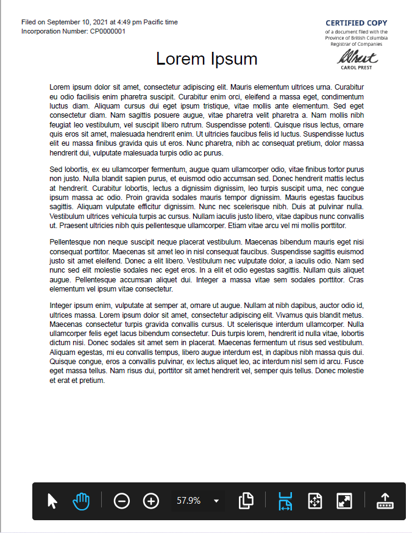

- Start Date: 2021-09-08
- Target Major Version: (EPIC or User Story TAG|Link)
- Reference Issues: n/a
- Entity Issue: https://github.com/bcgov/entity/issues/7217
- Implementation PR: 

# Summary

Some documents uploaded by the users need to be stamped with the current registrar's signature and texts such as date and time of filing and incorporation number. These documents are PDF files which need to be composited with image and text to generate certified copies of the user documents.

# Basic example

Example of a Python script that can add text and image to a PDF file using PyMuPDF:
``` python
import fitz
import datetime

x_margin = 30
y_margin = 30

fontfile="BCSans-Regular.ttf"

def get_signture_rect(page, pixmap):
    x0 = page.mediabox.width - x_margin - pixmap.width/2
    y0 = y_margin
    x1 = x0 + pixmap.width/2
    y1 = y0 + pixmap.height/2
    return fitz.Rect(x0, y0, x1, y1)  

def get_formatted_current_datetime():
    now = datetime.datetime.now() # TODO: add timezone
    hour = now.strftime('%I').lstrip('0')
    return now.strftime(f'%B %-d, %Y at {hour}:%M %P Pacific time')


doc = fitz.open("original_document.pdf") # original file
page = doc[0] # load page (0-based)
page.wrap_contents()
pix = fitz.Pixmap("watermark.png")

# Add image
signature_rect = get_signture_rect(page, pix)
page.insert_image(signature_rect, 
                  pixmap=pix, 
                  overlay=True, 
                  rotate=0)

# Add text
date_time_str = get_formatted_current_datetime()
text = 'Filed on ' + date_time_str + '\nIncorporation Number: CP0000001'
text_start_point = fitz.Point(x_margin, y_margin+6) 

fontcolor = (33/255, 37/255, 41/255)
page.insertText(text_start_point, 
                text,
                fontsize=10,
                fontfile=fontfile,
                color=fontcolor)

doc.save("output.pdf")
```

Example of output with text and image added to an existing PDF file:



# Motivation

To provide a way of adding a registrar's stamp to create a certified copy of documents uploaded by the user similarly to the manual process of certifying documents. 

# Detailed design

The idea consists of a function that receives the original pdf file and adds the current registrar's signature, the incorporation number and the current date and time in the Lear project. A database table may be necessary to be created in order to store the registrar's signature to be stamped to the user's document as the registrar can change over time.  

Important things to check before processing the files:
- It is a valid PDF file
- PDF file is not encrypted
- Page size is letter

The chosen library to implement it is PyMuPDF that can add text and image directly to the PDF file and seems to have some flexibility to meet all the requirements to manipulate PDF files. 

# Drawbacks

PyMuPDF seems to have a reasonable documentation but some links may show you outdated code and sometimes the developer needs to do calculations to align an object on the page that can be tricky or may lead them to error. 

# Alternatives

- PyPDF2

# Adoption strategy

The implementation can be as simple as creating a new utility function to be used by other modules in Lear project and there are not any impact doing that for the project. 

# Unresolved questions

- Are the input documents always in Letter page size?

# References

- https://pymupdf.readthedocs.io/en/latest/
- https://github.com/pymupdf/PyMuPDF
- https://pythonhosted.org/PyPDF2


# Thanks

This template is heavily based on the Vue, Golang, React, and other RFC templates. Thanks to those groups for allowing us to stand on their shoulders.
