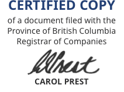

- Start Date: 2021-09-08
- Target Major Version: 
- Reference Issues: n/a
- Entity Issue: https://github.com/bcgov/entity/issues/7217
- Implementation PR: 


# Summary

When a user is filing a Cooperative Incorporation, Rules and Memorandum documents uploaded by the user need to be stamped with the current registrar's signature and texts such as date and time of filing and incorporation number. These documents are PDF files which need to be composited with image and text to generate certified copies of the user documents.


# Basic example

Example of a Python script that can add text and image to a PDF file using PyPDF2 and ReportLab:
``` python
import datetime
import PyPDF2
from reportlab.pdfgen import canvas
from reportlab.lib.pagesizes import letter


def stamp_pdf(input_pdf, output, watermark):
    watermark_obj = PyPDF2.PdfFileReader(watermark)
    watermark_page = watermark_obj.getPage(0)

    pdf_reader = PyPDF2.PdfFileReader(input_pdf)
    pdf_writer = PyPDF2.PdfFileWriter()

    # Watermark all the pages
    for page in range(pdf_reader.getNumPages()):
        page = pdf_reader.getPage(page)
        page.mergePage(watermark_page)
        pdf_writer.addPage(page)

    with open(output, 'wb') as out:
        pdf_writer.write(out)

def get_formatted_current_datetime():
    now = datetime.datetime.now() # TODO: add timezone
    hour = now.strftime('%I').lstrip('0')
    return now.strftime(f'%B %-d, %Y at {hour}:%M %P Pacific time')

def create_stamp():
    original_pdf = PyPDF2.PdfFileReader("original_document.pdf","rb")
    original_pdf_first_page = original_pdf.getPage(0)

    pdf_file = 'stamp.pdf'
    can = canvas.Canvas(pdf_file, pagesize=letter)

    image_x_start = original_pdf_first_page.mediaBox.getWidth() - 150
    image_y_start = original_pdf_first_page.mediaBox.getHeight() - 150

    img_file = 'signature.png'
    can.drawImage(img_file, image_x_start, image_y_start, width=120, preserveAspectRatio=True, mask='auto')

    text = 'Filed on ' + get_formatted_current_datetime() + '\nIncorporation Number: CP0000001'
    text_x_margin = 30
    text_y_margin = original_pdf_first_page.mediaBox.getHeight()-35
    line_height = 14
    for line in text.splitlines():
        can.drawString(text_x_margin, text_y_margin, line) # TODO: use BCSans font 10px
        text_y_margin -= line_height
 
    can.showPage()
    can.save()
 
create_stamp()
stamp_pdf(input_pdf='original_document.pdf', 
          output='watermarked.pdf',
          watermark='stamp.pdf')
```

Example of output with text and image added to an existing PDF file:


# Motivation

To provide a way of adding a registrar's stamp to create a certified copy of documents uploaded by the user similarly to the manual process of certifying documents. 


# Detailed design

The idea consists of a utility function that receives the original pdf file and adds the current registrar's signature, the incorporation number and the current date and time in the Lear project when the user successfully files a Cooperative Incorporation. 

Currently for Lear project reports, the registrar's signature is separate from the text ("CERTIFIED COPY") and registrar's name. For this implementation the UX team provided an image that can be directly added to the document:




This new file with the registrar's signature should be added to Lear project and the current signature image should be retrieved from the [RegistrarInfo](https://github.com/bcgov/lear/blob/main/legal-api/src/legal_api/reports/registrar_meta.py) class.


## Validation

Important things to check before processing the files:
- Must be a valid PDF file
- PDF file must not be encrypted
- Page size must be letter


# Drawbacks

There is no way to validate that a document with the text and stamped signature is an authentic certified copy of the document.

Changing the registrar's signature would demand a new deploy as the registrar's data is hardcoded in [RegistrarInfo](https://github.com/bcgov/lear/blob/main/legal-api/src/legal_api/reports/registrar_meta.py) class.

The current design does not consider stamping documents with different page sizes as it can be required in the future.


# Alternatives

It was considered using [PyMuPDF](https://gist.github.com/andrepestana-aot/014715e5af6d4a4753628f4b46e4a0d2) as an alternative to use PyPDF2.


# Adoption strategy

The implementation can be as simple as creating a new utility function to be used by other modules in Lear project and there is no impact doing that for the project. This can be also broken in smaller pieces like a generic function to add an image to a PDF and another generic function to add text to a PDF. This way other use cases can make use of them in the future. 


# References

- https://pythonhosted.org/PyPDF2
- https://github.com/mstamy2/PyPDF2
- https://code-maven.com/add-image-to-existing-pdf-file-in-python
- https://www.reportlab.com/opensource/
- https://pymupdf.readthedocs.io/en/latest/
- https://github.com/pymupdf/PyMuPDF


# Thanks

This template is heavily based on the Vue, Golang, React, and other RFC templates. Thanks to those groups for allowing us to stand on their shoulders.
