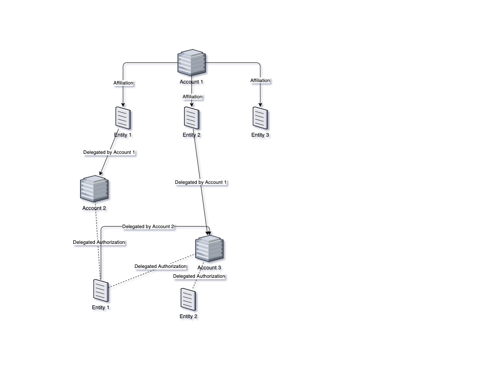
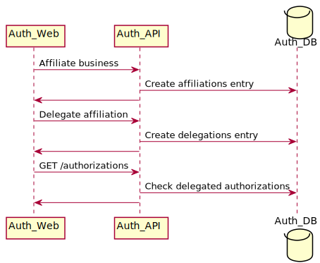
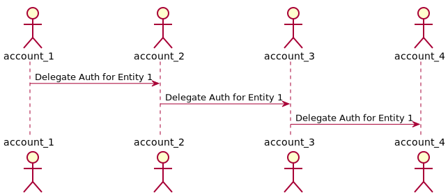

- Start Date: 2021-10-01
- Target Major Version:
- Reference Issues: n/a
- Issue: https://github.com/bcgov/entity/issues/9001
- Implementation PR: (leave this empty)

# Summary
This RFC covers 2 related topics. 
- Delegation : Option for  account to delegate their authorization on a business to another account.
- Fine Grained Permissions : User level fine grained permission on what they can perform  on the account.


# Motivation

Delegation would be required when multiple accounts needs to work on the same business. 
Fine grained permission is needed to restrict the permission when the ADMIN, COORDINATOR, USER groups are not good enough for accounts to handle their use cases.

# Detailed design
## Delegation
Currently the authorization of a business is based on the affiliation. If the business is affiliated to an account, then all the members (Administrators, coordinators and users) would get authorization to perform any filing on the business under that account context.
Delegation would enable the authorization on a business to other accounts without manually affiliating the business.


See below for logical diagram on how delegation would work on account and entity level.



### Implementation
An account administrator (or account user with delegate permission) will be able to delegate entity access to a different account. 
When an entity is delegated, effectively that entity becomes an affiliated entity to the new account, without new affiliation records in the database.
<p>

| Attribute      | Description |
| ----------- | ----------- |
| delegated_by      | Account ID which initiated delegation    |
| delegated_to   | Account ID which received delegated access        |
| affiliation      | Affiliation reference    |
| parent_delegation      | Reference of the parent delegation when a delegated authorization is delegated    |


</p>
### Sequence

<!--
```
@startuml rfc-delegation-and-permissions/delegation_seq
participant Auth_Web
participant Auth_API
database    Auth_DB

Auth_Web -> Auth_API: Affiliate business
Auth_API -> Auth_DB: Create affiliations entry
Auth_API -> Auth_Web: 
Auth_Web -> Auth_API: Delegate affiliation
Auth_API -> Auth_DB: Create delegations entry
Auth_API -> Auth_Web: 
Auth_Web -> Auth_API : GET /authorizations 
Auth_API -> Auth_DB : Check delegated authorizations
Auth_API -> Auth_Web: 
@enduml
```
-->




Delegation can go on any level i.e, 

<!--
```
@startuml rfc-delegation-and-permissions/n_delegation
actor    account_1
actor    account_2
actor    account_3
actor    account_4

account_1 -> account_2: Delegate Auth for Entity 1
account_2 -> account_3: Delegate Auth for Entity 1
account_3 -> account_4: Delegate Auth for Entity 1

@enduml
```
-->



#### Revocation
When a delegated authorization is revoked at any given time by the delegated, any delegation which have that parent delegation would get revoked. 

i.e, in above example when the delegation from Account 1 -> Account 2 is revoked, the delegation from Account 2 -> Account 3 would also get revoked. 

## Fine Grained Permissions
Currently all the permissions are grouped under the role for an user.
i.e, ADMIN, COORDDINATOR, USER encapsulates group of permissions for all the permissions they can perform on that account.
Auth-Web enforces these permissions on the UI using custom directive `v-can`. 

> Sample usage, `v-can:INVITE_MEMBERS.hide`


### Implementation
`permissions` table is used to manage the role (ADMIN, COORDINATOR, USER) to permissions mapping. 

We would need 2 levels fine grained permissions;
- Fine grained permission on user level : Permissions are initially inherited from the role (ADMIN, COORDINATOR, USER).
Account member with sufficient permissions can add/remove permissions for each user from the inherited permissions list. This would get saved against the membership and will be used for authorization.
- Fine grained permission on delegation : When an entity is delegated, the delegtaing account can decide the list of permissions the delegated account would receive on that entity. On the subsequent delegations, the delegated permission would act as the available list of permissions.

<p>

| Attribute      | Description |
| ----------- | ----------- |
| permission      | Permission label    |
| membership_type_code   | Role name        |
| membership_id      | Permission specific to user on the account    |
| delegation_id      | Permission specific to the delegation    |


</p>


# Drawbacks
The authorizations response size would increase as more and more permissions are added the system.


# Alternatives
For delegation, it can use re-affiliating the entity with the passcode on new account. But cannot handle revocation with this flow.

# Adoption strategy

Priortize either delegation or fine grained permission at a time and eventually achieve both. 

# Unresolved questions

None


# References

