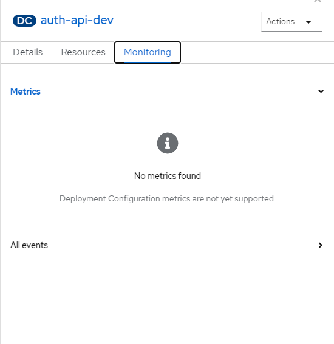

# RFC for DeploymentConfig to Deployment

- Start Date: (2021-11-09)
- Target Major Version: [#10015](https://github.com/bcgov/entity/issues/10015)
- Reference Issues: (None)
- Entity Issue: (None)
- Implementation PR: (None)

# Summary

Currently, we are using DeploymentConfig to handle the deployment of applications in Openshift. We need to use Deployment to handle the deployment in Openshift or Cloud.

From [OpenShift](https://docs.openshift.com/container-platform/4.6/applications/deployments/what-deployments-are.html#deployments-comparing-deploymentconfigs_what-deployments-are):

```text
Both Kubernetes Deployment objects and OpenShift Container Platform-provided DeploymentConfig objects are supported in OpenShift Container Platform; however, it is recommended to use Deployment objects unless you need a specific feature or behavior provided by DeploymentConfig objects.
```

# Basic example

- Deployment

```yaml
apiVersion: apps/v1
kind: Deployment
metadata:
  name: hello-openshift
spec:
  replicas: 1
  selector:
    matchLabels:
      app: hello-openshift
  template:
    metadata:
      labels:
        app: hello-openshift
    spec:
      containers:
      - name: hello-openshift
        image: openshift/hello-openshift:latest
        ports:
        - containerPort: 80
```

- DeploymentConfig

```yaml
apiVersion: v1
kind: DeploymentConfig
metadata:
  name: frontend
spec:
  replicas: 5
  selector:
    name: frontend
  template: { ... }
  triggers:
  - type: ConfigChange
  - imageChangeParams:
      automatic: true
      containerNames:
      - helloworld
      from:
        kind: ImageStreamTag
        name: hello-openshift:latest
    type: ImageChange
  strategy:
    type: Rolling
```

# Motivation

```text
A DeploymentConfig (DC) in OpenShift is more or less equivalent to a Kubernetes Deployment, nowadays. Main difference (besides that one is using ReplicationController and the other using ReplicaSet as you rightly pointed out) is that

there are a few things you can do with a DeploymentConfig (around triggers) that you can't do with a Deployment.

DeploymentConfig's are first-class citizens in the Web console.

The reason DeploymentConfig's exist is because we (Red Hat) are innovating. In other words: DeploymentConfig's predate Deployment's and while we're always trying to propose these innovations upstream, they are not always accepted by the community as is. For example, in the case of RBAC, the stuff we had in OpenShift was accepted upstream and that's why you have the same RBAC resources etc. now in OpenShift and Kubernetes. With DeploymentConfig's that was not the case. Over time one would expect that DeploymentConfig's are phased out in favor of Deployment's but I can't give you a timeline. If portability is your primary concern, I'd say, use Deployment's.
```

## Benefits

- Monitoring

  Openshift come up with lots monitoring metrics. The DepolymentConfig doesn't show up those metrics directly. However, Deployment do not have this issue.

  DeploymentConfig
  

  Deployment
  

- Migration to Kubernetes

  DeploymentConfig doesn't support by Kubernetes. If we want to migrate our applications to Kubernetes, we have to convert to Deployment.

# Detailed design

# Drawbacks

Deployment doesn't support lifecycle hook which we use it for the data migration. However, we can use the "initContainers" to replace it.

[Demo App](https://console.apps.silver.devops.gov.bc.ca/k8s/ns/73c567-tools/deployments/auth-api-dev)

# Adoption strategy

Create Helm Charts for API/UI/QUEUE/JOB applications and use Deployment object to handle the deployment. ArgoCD will take care of the deployment flow.

# Unresolved questions

# Thanks

# Appendix
