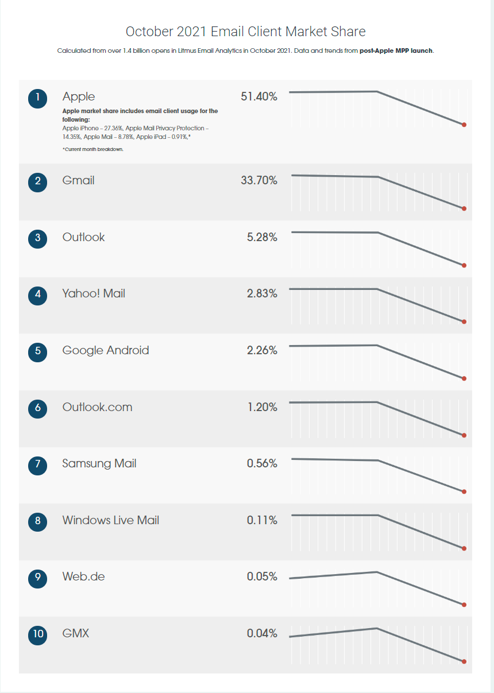
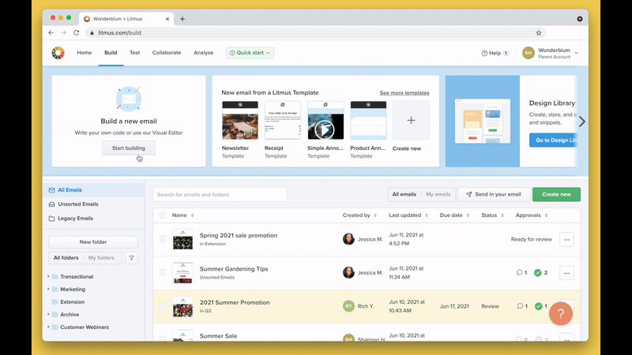
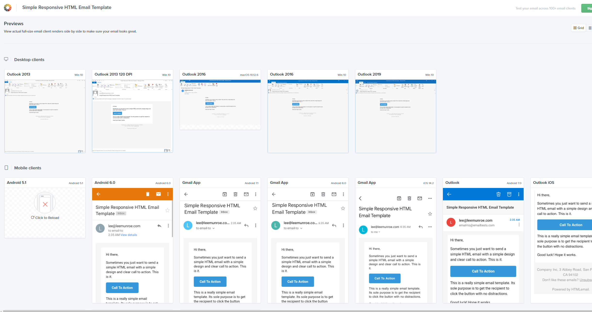

- Start Date: 2021-11-04
- Target Major Version: [Accommodating email templates](https://github.com/bcgov/entity/issues/9073)
- Reference Issues:
- Entity Issue:
- Implementation PR:

# Summary

Research email templates that support multiple email clients between desktop and mobile devices.

# Basic example

[A sample of responsive email template](http://htmlpreview.github.io/?https://github.com/TedGoas/Cerberus/blob/master/cerberus-hybrid.html)

# Motivation

Nowadays, more and more people use mobile phones to check emails. We must make sure that the email looks good and displays all the details on any device and email client.

The reasons why we had issues of existing email templates:

- Media query

  Media query is a CSS technique introduced in CSS3 for all standard devices. Some email clients like Yahoo or the client is using IMAP protocol are not supported.

- CSS standard

  Outlook for windows only support a subset of the CSS2.1 specification. Also, the gmail clients support different version CSS standards according to [this article](https://www.hteumeuleu.com/2016/trying-to-make-sense-of-gmail-css-support-after-the-2016-update/)

The email clients market share from Litmus Email Analytics.

# Detailed design

[Litmus](https://www.litmus.com/), [Mailchimp](https://mailchimp.com/) and [Campaign Monitor](https://www.campaignmonitor.com/) are the leading industry company. They provide online service to let you create/build, manage, export and testing the email templates.

# Drawbacks

The litmus service cost USD$63 a month. And lots of function we may need to use it.

# Alternatives

We can use some free and popular responsive email templates. However, we must create, manage and test email templates based on our own modifications.

[Cerberus](https://tedgoas.github.io/Cerberus/)

[Zurb](https://zurb.com/playground/responsive-email-templates)

[leemunroe](https://github.com/leemunroe/responsive-html-email-template)

Also testing tools:

[Postdrop](https://app.postdrop.io/)

# Adoption strategy

- Request the licesen if we want to adopt Litmus (for example);
- Change management team/project team gather/create email template requirments;
- UX designer login into online service to build/create templates;
- BA verify the templates through the online testing tools;
- Export/download the templates to developers to do integration;

    [Flask & jinja2 integration](https://code.luasoftware.com/tutorials/flask/generate-html-email-using-flask-and-jinja2/)

# Unresolved questions

N/A

# Thanks

This template is heavily based on the Vue, Golang, React, and other RFC templates. Thanks to those groups for allowing us to stand on their shoulders.
