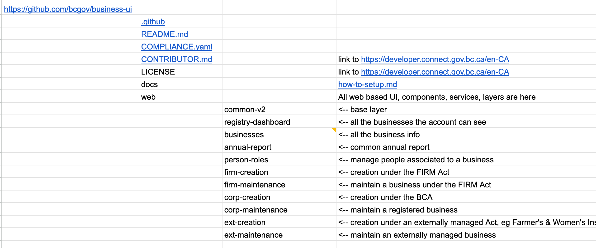
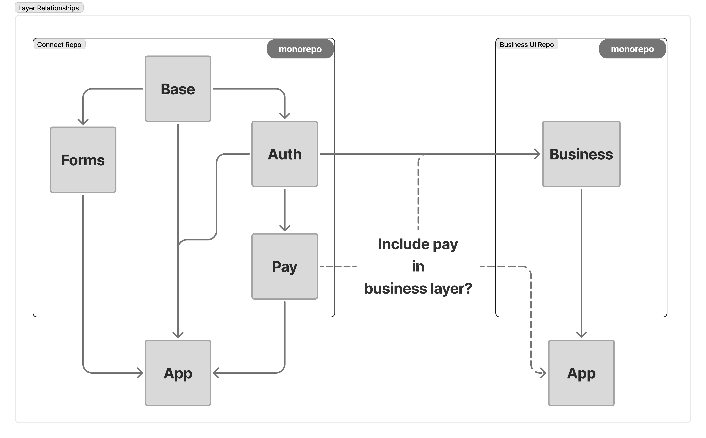

# RFC: Entities Frontend Modernization (Nuxt 4 + Connect Layer)

**Author:** Cameron Bowler  
**Status:** DRAFT  
**Created:** October 1, 2025  
**Last Updated:** October 3, 2025  
**Reviewers:** Shahriar Khan, Severin Beauvais, Mikaela Bertucci, Melissa Stanton, Sal Hamood, Thor Wolpert, Dietrich Worlpert

---

## 1. Purpose

Our Entity UIs currently run on a deprecated **Vue 2** framework with legacy dependencies (including SBC Common Components and several outdated npm libraries). Modernizing to **Nuxt 4** with the **Connect Layer** will reduce technical debt, standardize patterns, and unlock faster change velocity while maintaining feature parity.

This RFC builds on the existing modernization work already underway in the `business-ui` monorepo, as presented in sprint reviews and Developer COPs.

---

## 2. Background

- Several Entity projects are built with **Vue 2 / Vuetify 2**, and rely on SBC Common Components for authentication and other shared UI (e.g., footer, Pay).
- A PoC by the **Assets** team successfully upgraded to **Vue 3 / Nuxt** with a Connect extension (still on Vuetify), demonstrating feasibility.
- A **direct Nuxt migration** avoids a two-step rewrite (Vue 2 → Vue 3 → Nuxt).
- The transition and officer change filings are already leveraging the in-progress **business layer**, built on top of the Connect Nuxt layers.

---

## 3. Proposal

### 3.1 What we’re doing
- **Start with the low volume entity filings** to validate integration patterns, estimate effort, and de-risk the broader migration.
- Adopt **Nuxt 4 + Connect Layer** as the core, with component strategy (Vuetify 3 → NuxtUI/Tailwind) aiming for long-term simplification.
- Break down filings incrementally, allowing each new UI to plug into the business layer and extend it as needed.

### 3.2 Value
- Lower maintenance cost, unified authentication via Connect, improved DX (Developer Experience), and reuse of shared components—accelerating Create/Edit migrations after the pilot.
- DX improvements include auto imports, reduced boilerplate, faster hot reloads, improved dev tools, and Nuxt Layers for shared code reuse.

### 3.3 Scope (UIs & filings)
**Filings UI**:
1. AGM Extension
2. AGM Location Change
3. Amalgamation Out
4. Annual Report
5. Consent Amalgamation Out
6. Consent Continuation Out
7. Continuation Out
8. Court Order
9. Notice Of Withdrawal
10. Director Change Filing (COD)
11. Office Address Change Filing (COA)
12. Non‑filing: Amalgamation Selection
13. Non‑filing: Digital Business Card pages

**Create UI**:
1. Amalgamation
2. Continuation In
3. Voluntary Dissolution
4. Voluntary Dissolution – Firms
5. Incorporation Application
6. Registration
7. Restoration

**Edit UI**:
1. Coop Correction
2. Corp Correction
3. Firm Correction
4. Alteration (Company Information)
5. Change of Registration
6. Firm Conversion
7. Limited Restoration Extension
8. Limited Restoration Conversion to Full
9. Special Resolution

---

## 4. Technical Details

### 4.1 Migration Targets
- Vue 2 → **Vue 3**
- Vuetify 2 → **Vuetify 3** *or* **NuxtUI/Tailwind**
- **Nuxt 4** as the application framework

### 4.2 Integration Considerations
- Integrate **Connect Layer** and decouple from SBC Common Components; assess compatibility and regression risks up front.
- Include the **business layer** built on Connect, which supports filings like transition and officer changes.

### 4.3 Repository Strategy (confirmed alignment)
This RFC aligns with the ongoing work presented in sprint reviews and Developer COPs:
- A **Nuxt 4/NuxtUI base layer** is already being laid into the `business-ui` monorepo.
- Initial layout includes common components, registry dashboard, and filing flows.

### Layer Relationships
The modernization approach leverages two monorepos:
- **Connect Repo**: Base, Forms, Auth, Pay, App layers.
- **Business UI Repo**: Business layer and App layer.

*Open question: Should Pay be included in the Business layer?*

---

## 5. Implementation Plan

### 5.1 Phases & Milestones
1. **Vue 3 + Nuxt + Connect**: integrate the modern stack into the lowest‑risk repo (Filings).
2. **Shared Functionality Rewrites**: convert mixins and other shared logic to composables.
3. **Component Rewrites**: move to Vuetify 3 or NuxtUI + Tailwind with parity to current behavior.
4. **Unit Testing Suite Upgrade**: align tests with the new stack.
5. **Repeat for Create/Edit**: apply the same process.

## 5.2 Sizing & Timeframe (Incremental Filing Approach)

Rather than estimating for an entire UI upfront, we will start with **lowest-volume filings** and migrate them **one at a time**. This approach allows us to validate patterns, refine the business layer, and adjust estimates based on real-world experience.

#### **Initial Estimates (per filing, subject to refinement):**
- **Base setup & integration** — foundational work completed once; minimal per filing.
- **Business layer extensions** — varies by filing complexity (e.g., annual report vs. director change).
- **UI migration (pages & flows)** — incremental; scope depends on filing-specific screens and dialogs.
- **Shared components alignment** — addressed progressively as filings adopt NuxtUI/Tailwind.
- **Unit tests & QA** — integrated with each filing migration; parallel execution where possible.

#### **Timeframe Guidance:**
- **First filing**: expect higher effort for setup and pattern definition (approx. 2–3 weeks).
- **Subsequent filings**: reduced effort as reusable components and business layer mature (approx. 1–2 weeks per filing, subject to complexity).
- **Create/Edit UIs**: timeline TBD after initial filings; likely similar incremental approach.

> **Note:** These estimates will be revisited after completing the first few filings to ensure accuracy and reflect lessons learned.

### 5.3 Execution Model

- **Manpower sequencing**: Begin with **minimal developers** for initial setup and first filing migration to establish patterns and validate the approach. After this, **parallelize across the team** for subsequent filings as reusable components and business layer mature.
- **Incremental delivery**: Each filing will be migrated independently, allowing for continuous feedback and refinement of estimates and patterns.
- **Environments**: Maintain a **parallel development environment** or use **feature branches deployed to DEV for comparison with TEST**. Gate releases with **feature flags** to minimize risk and enable controlled rollout.
- **SRE dependency**: Keep infrastructure changes minimal by leveraging existing environments and feature branches. Call out any impact on ongoing Entities development early and plan for coordination if additional environments or permissions are required.

---

## 6. Options & Trade‑offs

| Option | Description | Pros | Cons |
|--------|-------------|------|------|
| 1 | No upgrade | — | Compounding technical debt; poor DX; support risk and potential cost for extended Vue 2 support |
| 2 | Vue 3 + Vuetify 3 | Familiar stack; lowest LOE | Still tied to Vuetify; partial rewrites still required |
| 3 | Vue 3 + Vuetify 3 + Nuxt + Connect | First step to modern; Connect access | Dual libraries; higher effort/time |
| 4 | **Nuxt 4 + Connect + NuxtUI/Tailwind** | Modern, scalable; aligns with contemporary stack; most long-term value | Component rewrites; learning curve; highest initial effort |

---

## 7. Risks & Mitigations

- **Code syncing** with active development → dedicated branch strategy and weekly sync; feature flags
- **Resourcing & skills mix** → named core team; pair programming; targeted spikes
- **Shared components drift** → parity tests; coordinated PR reviews across Entity and shared‑components maintainers
- **Estimate stability** → working agreement and change‑control guardrails
- **Auth/Connect integration** unknowns → early spike, checklist for session lifecycle and edge cases

---

## 8. Open Questions

- ✅ **Resolved:** Entities modernization will live inside the **Business‑UI** mono-repo, leveraging the Nuxt 4/NuxtUI base layer already in progress.
- What level of design fidelity is expected for parity vs. modernization during component rewrites?
- Should Pay be included in the Business layer?

---

## 9. References

- Working Document: [Entities Frontend Modernization](https://bcgov-my.sharepoint.com/:w:/r/personal/cameron_bowler_gov_bc_ca/Documents/Entities_Frontend_Modernization.docx?d=w36c99495b63745b8bd3137d2e29fba68&csf=1&web=1&e=WN2Iw2)
- Low Volume Filings: To be prioritized in collaboration with Product Owners and stakeholders. Document to be created.
