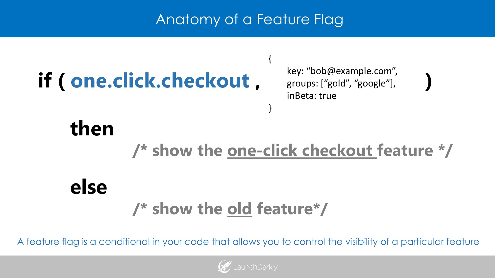

- Start Date: 2019-09-12
- Target Major Version: >=1.1
- Reference Issues: 
- Entity Issue: bcgov/entity#1274
- Implementation PR: pending

# Summary

The Entity team(s) will implement **_Feature Flags_** to decouple code/artifact promotion from feature rollout and availability. This will also allow for alternative feature rollout approaches allowing the _Product Owner_ to allow access to features on a number of different criteria, such as role, username, entity_identifier, etc.

# Basic example

A _feature flag_ can be thought of as a structured **if (test) -> then** with generally some tooling outside of the core system managing the _test_ that is being used.


These can be either static, or dynamic _flag_test_. A commonly used flag in place currently by the teams is running the apps & services in dev, test or prod mode. This RFC is more focused on the system that will manage dynamic flags in the deployed and running system.

# Motivation

There are multiple teams working on disparate _User Stories_, _Features_ and alternative releases that require different versions of components that may not all be released in their entirety to all users.

Using a combination of versioning (SemVer services in another RFC) and _Feature Flags_ will allow code releases, without enabling all of the features to all users of the system at the same time.

Feature flags are a common approach, and anyone that have seen messages in GitHub to _opt in to a beta feature_ has seen it in action, or read about it in [GitHub Engineering Blogs](https://github.blog)

# Detailed design

The _Entity_ team _A for Apis_ will implement the hosted [LaunchDarkly](https://launchdarkly.com) for managing feature rollout.

The appropriate LaunchDarkly SDK will be wrapped used to access the flag features. 

Flags will be assigned by a smaller group of admins to wrap all features in a User Story.

For local dev / testing the flags in use will be maintained in a config file and leveraged via code similar to (for example in python):
```python
from ldclient.integrations import Files
data_source = Files.new_data_source(paths=[ myFilePath ])
config = Config(update_processor_class=data_source)
```
The code to manage the local test configs will be implemented within the framework and is not something that all team members are expected to do.

# Drawbacks

Like any powerful tool, it can rip your arm off, or make life easier and tasks can be completed faster and more efficiently.

All transient flags should be treated like technical debt, and have a lifecycle of when they are implemented and almost more importantly, are removed from the system.

Feature flags add complexity to security, testing, and management.

They are great, but they are not a silver-bullet and must be managed like any other configuration and code deployment.

# Alternatives

## Self created flag management
The teams could do write their own system, but the time to implement would likely cost more than the tooling being paid for.

## Alternatives to LaunchDarkly
Most of their competitors are less expensive, as LD has set the bar and no one has better features allowing them to charge more. The several other offerings looked at all had less features, integrations and reporting.

## Not doing this
Deploying features would require more extensive SCM branch management, more advanced deployment / rollback and canary testing environments.

# Adoption strategy

Covered above.

# Unresolved questions

None at this time.

# Thanks

Text & Graphics leveraged from 
- [featureflags.io](http://featureflags.io)
- [martinfowler.com](https://martinfowler.com/articles/feature-toggles.html#WorkingWithFeature-flaggedSystems)

This template is heavily based on the Vue, Golang, React, and other RFC templates. Thanks to those groups for allowing us to stand on their shoulders.
