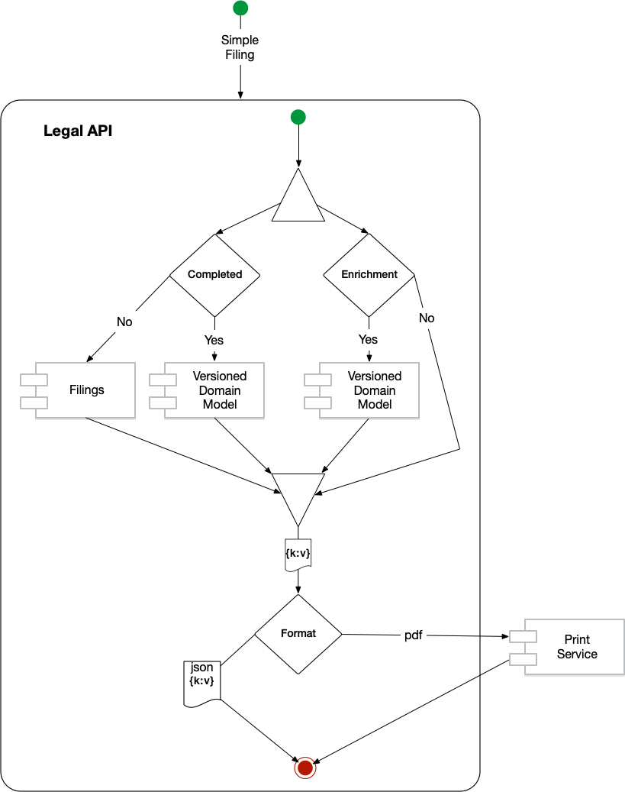
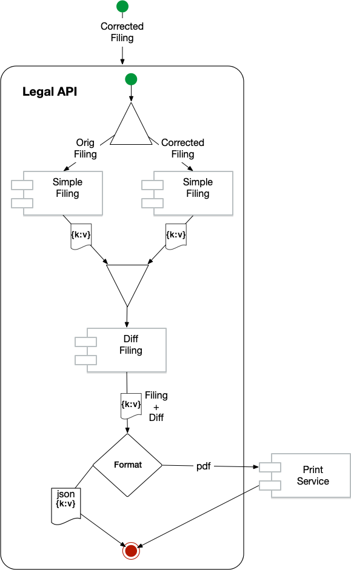
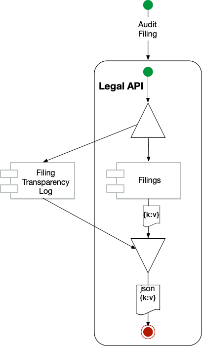

- Start Date: 2020-08-30
- Target Major Version: (EPIC or User Story TAG|Link)
- Reference Issues: (fill in existing related issues, if any)
- Entity Issue: (leave this empty)
- Implementation PR: (leave this empty)
- Submitters: Lekshmi Mallika and Thor Wolpert

# Summary

This expands on [rfc-legal-registry-ledger](rfc-legal-registry-ledger.md) to handle filings specifically.

The approach will start to follow a somewhat hexagonal architecture, with the current model abstracted and include the filing document as core.

This approach will both maintain the submission filing as part of the audit history and produce an equivalent filing in the most recent JSONSchema version. This will allow conversion to pdf and other such translation to support a much more limited set versions, which is desireable.

Corrections and changes can be obtained by diff'ing the Filings JSONSchema, further leveraging our investment.

# Detailed design

Other RFCs will cover additional areas in more detail, so that this document can share this approach now as corrections are currently underway.

### Simple Filing

Following is the workflow to return a simple filing.

The raw JSON in the filing table is returned until such time as it is rendered into the domain model and marked COMPLETED. After being COMPLETED, the filing is created from the versioned domain model.

Filings like _Annual Report_ can also return other useful information such as the directors in place at the time of filing via the _Enrichment_ process.

### Corrected Filing

A corrected filing is the result of retrieving the _simple_filing_ for the correction, and including the differences to the original simple filing.
The original is not returned.

### Audit Filing (aka Raw)

This returns the historical JSON as submitted by the customer.

# Drawbacks

This approach is more expensive in terms of compute, but it is simpler to maintain, does not rely on external clients to be truthful or function without error, and goes back to the original design semantics of only supporting POST/PUT/GET/DELETE. There is no PATCH support.

# Alternatives

- Storing the PDF of the filing output.
- Rolling forward the stored filing JSON with each upgrade
- the report renderer to support all versions of the JSON filing
  All of these approaches had significant draw backs and did not leverage the effort of having a versioned domain model.

# Adoption strategy

This approach is part of a move back to simple filings that are not merged, but state the expected end state of the business after the filing is applied.
There will be some impact to the AnnualReport, and Change of Directors, but it should end up being simpler to maintain.

# Thanks

This template is heavily based on the Vue, Golang, React, and other RFC templates. Thanks to those groups for allowing us to stand on their shoulders.
