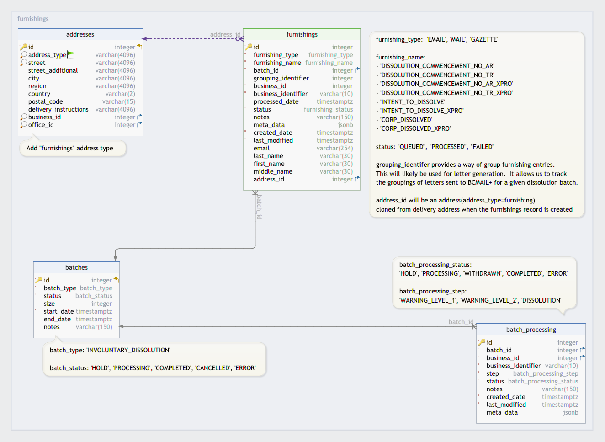
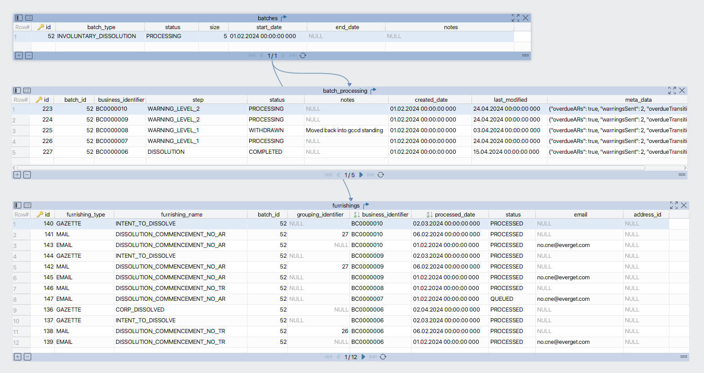

## Overview

The furnishings job will manage and track the notifications that need to go out as a part of the dissolution process.  This will include emails, physical mail and gazette notifications.

Batch data created by the involuntary dissolutions job will be used to determine which notifications need to go out for a business in dissolution.

Each notification (email, mail, gazette) will be tracked via a table(`furnishings`) that ties back to a given dissolution batch.

Email delivery will be handled by entity-emailer.

Mailing of letters will use the existing BCMail+ process other Registry teams have used.

Sending "intent to dissolve" and "business dissolved" datasets to the Gazette will done via XML.

MRAS messaging upon a business being dissolved will continue to use the existing processes in the legacy system.

COLIN API and the update colin filings job will be updated as required to support syncing of involuntary dissolution filings back to COLIN.


## Motivation

To flesh out some of the core technical details around how the various furnishings will be handled for involuntary dissolutions so that we can start furnishings related development.

Of particular interest is to extend the LEAR data model to support furnishing elements and define how it relates to involuntary dissolution batch tables(`batches`, `batch_processing`.

This is not meant to be exhaustive and a lot of the details around letters and gazette will be worked out as we implement the furnishings job.


## Data Model

### Furnishings



Furnishing entries for in progress batch run



## Furnishings Job

Assumptions:
- Runs once a day
- Runs after involuntary dissolution job
- Days of the week that a given stage can be run will be defined in `configuration` table


### Stage 1

1. Retrieve cron string from `DISSOLUTIONS_STAGE_1_SCHEDULE` in configuration table. This cron string stores which days of the week new dissolutions can be initiated.
2. If the current day of the week is not a valid day(use `DISSOLUTIONS_STAGE_1_SCHEDULE` to determine this), skip remaining steps in stage 1.
3. Find existing batches that are still in stage 1 of dissolution.
4. For matching batches that do not have any furnishing entries yet, do the following for each batch:
    1. Find all businesses where `business_processing.batch_id` = current batch id
    2. For all business matches that have emails:
        1. Create email furnishing entry
        2. Queue a message to emailer.  For more details, refer to email section of this document.
    3. For all business matches that don't have emails:
        1. Create letter furnishing entry
        2. Create and add letter to either AR or transition pdf.
    4. Send AR and transition pdf to BCMail+.  For more details, refer to letter section of this document.
5. For matching batches that have existing furnishing entries still in stage 1, do the following for each batch:
    1. Find all businesses for current batch that can be sent a letter
    2. For all business matches in batch, do the following:
        1. Create letter furnishing entry for each business match
        2. Create and add letter to either AR or transition pdf.
    3. Send AR and transition pdfs to BCMail+.  For more details, refer to letter section of this document.


### Stage 2

1. Retrieve cron string from `DISSOLUTIONS_STAGE_2_SCHEDULE` in configuration table. This cron string stores which days of the week new dissolutions can be initiated.
2. If the current day of the week is not a valid day(use `DISSOLUTIONS_STAGE_2_SCHEDULE` to determine this), skip remaining steps in stage 2.
3. Find existing batches that are in stage 2 of dissolution.
4. For matching batches that do not have any stage 2(`furnishings.name` = "INTENT_TO_DISSOLVE") furnishing entries yet, do the following for each batch:
    1. Create intent to dissolve furnishing entries
    2. Create required xml to send to gazette.
    3. Send xml to gazette.  For more details, refer to gazette section of this document.


### Stage 3

1. Retrieve cron string from `DISSOLUTIONS_STAGE_3_SCHEDULE` in configuration table. This cron string stores which days of the week new dissolutions can be initiated.
2. If the current day of the week is not a valid day(use `DISSOLUTIONS_STAGE_3_SCHEDULE` to determine this), skip remaining steps in stage 2.
3. Find existing batches that are in stage 3 of dissolution.
4. For matching batches that do not have any stage 3(`furnishings.name` = "CORP_DISSOLVED") furnishing entries yet, do the following for each batch:
    1. Create business dissolved furnishing entries
    2. Create required xml to send to gazette.
    3. Send xml to gazette.  For more details, refer to gazette section of this document.


## Notification Methods

### Emails

Email furnishing entries created in stage 1 will have a furnishing status of "QUEUED".

For more details around the processing of the email and the queue message format expected from the furnishings job, refer to the emailer section.


### Letters

The existing process of SFTPing PDF files to BCMail+ will be used.

There will need to be additional work to review how other Teams in Registries have implemented this letter generating functionality and how the letters are transferred to BCMail+.


### Gazette

The datasets representing intent to dissolve(stage 2) and businesses dissolved(stage 3) will be sent to BC Laws in XML format.  Note that this is a change from what the legacy system currently does, which is to SFTP files to BCLaws.

XML format for datasets and communication protocols related details will still need to be worked out with BC Laws.


### MRAS

Upon a business being dissolved a MRAS message is sent out.

This functionality will be taken care of by the legacy system as long as involuntary dissolutions are synced back to COLIN.


## Emailer

An email processor will be added to entity emailer for processing furnishing emails.

The queue message being sent from the furnishing job will have the following format:
```json
{
  "specversion": "1.x-wip",
  "type": "bc.registry.dissolution",
  "source": "furnishingsJob",
  "id": "f36e3af7-90c3-4859-a6f6-2feefbdc1e37",
  "time": "",
  "datacontenttype": "application/json",
  "identifier": "<business_identifier>",
  "data": {
    "furnishing": {
      "type": "<batch_type>",
      "furnishingId": "<furnishing_id>",
      "furnishingName": "<furnishing_type>"
    }
  }
}
```

`type` and the `furnishingName` are added to the queue message but only `furnishingId` will be used by the processor directly.  The other fields make debugging easier.

Upon successful processing of the email, the new furnishing email processor will update the status to "PROCESSED" for the relevant furnishing entry.

If the notify api returns an error in the entity emailer, the status will be set to "ERROR" for the corresponding furnishing entry.


## COLIN API / Update Colin Filings Job

Update update-colin-filings job and COLIN API as required to sync involuntary dissolutions back to COLIN


## Furnishing Listener

> [!NOTE]
> Do we need a listener when a queue furnishing messages has been processed?
>
> An example would be when emailer processes an email furnishing message.  Or can we do this processing in the emailer?
>
> Potentially this could also be used in a similar fashion when an involuntary dissolution filing is processed in the filer.


## Outstanding Questions

* Do we want to implement a furnishing listener?


