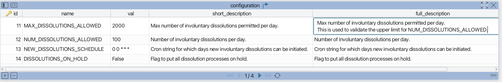

- Start Date: 2024-04-26
- Target Major Version:
- Reference Issues: n/a
- Entity Issue: [20937](https://github.com/bcgov/entity/issues/20937)
- Implementation PR: (leave this empty)


## Overview

The involuntary dissolution process will consist of two BE scheduled jobs - involuntary dissolutions job and furnishings job.

This process will be mostly automated with staff input only in the form of updating a configuration.  The configuration determines how many new businesses can be added to the dissolution process on a per day basis.

The involuntary dissolutions job will manage the overall dissolution process for batches of businesses where the dissolution process is kicked off.

The furnishings job will manage and track the notifications that need to go out as a part of the dissolution process.  This will involve emails, physical mail and any other required notifications made to external systems.  Functionality to reconcile BCMail+ physical mail outs and potentially track bounced emails(if required) may be handled in this job as well.

These jobs will operate independently, but there will likely be some dependencies where one job may depend on some of the data generated by the other.  For example, the furnishings job will likely need to reference the active **batches** table data generated by the involuntary dissolutions job to determine which businesses to add to the furnishing tables to schedule the required notifications for new batches of business that have been initiated in the dissolution process.

The legal api will also be extended to provide the following functionality:
* Addition of warnings to GET /business response
  * Eligible for involuntary dissolution i.e. multiple ARs not filed and other relevant conditions
  * Business is in process of being involuntarily dissolved
* Configuration endpoint
* Businesses eligible for dissolution count
* Providing a way of excluding a business from dissolution process

Involuntary Dissolution functionality will be feature flagged on BE and FE.

Note: The furnishings job is touched on in this document for the purposes of starting to understand how this job may fit with the involuntary dissolutions job.  As there are still some unknowns around this work and the fact that a lot more detailed design work is still required, the furnishings job will be fleshed out more in the near future.

## Motivation
To flesh out some of the core technical design for the involuntary dissolution process so we can start implementation.


## Data Model

### Batches
Batch tables will be used to keep track of batches of businesses involved in involuntary dissolutions.  Each business also has individual processing statuses tracked via **batch_processing** table.


Completed Batch Run Example


In-Progress Batch Run Example


### Configuration
A generic configuration table will be created to allow storing of key/value pairs.

This table will be updated via the Legal API.




### Businesses

A new **no_dissolution** field will be added to the **businesses** table.

This field is intended to exclude a business from being selected as a candidate for the involuntary dissolution process.


## Involuntary Dissolutions Job

Assumptions:
- Runs every day
- Maximum number of dissolutions that can be initiated per day will be retrieved from **configuration** table
- Number of dissolutions that can be initiated per day will be retrieved from **configuration** table
- Days of the week that dissolutions can be initiated will be retrieved from **configuration** table
- Dissolution on-hold flag will be retrieved from **configuration** table

### 1. Dissolutions on-hold check
1. Retrieve **DISSOLUTIONS_ON_HOLD** flag in **configuration** table.
2. If flag is true, update all in-progress **status** columns in **batches** and **batch_processing** to **HOLD**.
3. Exit the job as no new businesses should enter the dissolution process and businesses already in the dissolution processes should also halt all processing.

Notes:
* In the case where it is required to only halt new eligible businesses from entering the involuntary dissolution process, the **NUM_DISSOLUTIONS_ALLOWED** configuration can be set to zero.  Businesses that were already in the process of being dissolved before **NUM_DISSOLUTIONS_ALLOWED** was set to zero would continue the dissolution process.

### 2. Initiating dissolution process for new businesses where AR has not been filed for 2 yrs and 2 months
Use **businesses.last_ar_date** and other relevant business rules to determine candidate businesses that can enter dissolution process.

1. Retrieve cron string from **NEW_DISSOLUTIONS_SCHEDULE** in **configuration** table.  This cron string stores which days of the week new dissolutions can be initiated.
2. If the current day of the week is not a valid day(use **NEW_DISSOLUTIONS_SCHEDULE** to determine this) to initiate dissolutions, skip steps(3-7) for creating a new batch businesses to dissolve.
3. Retrieve first **NUM_DISSOLUTIONS_ALLOWED** number of businesses to initiate the involuntary dissolution process for
4. Create a new entry in **batches** table which will be used to uniquely identify the set of businesses that will be dissolved potentially if involuntary dissolution criteria is still met after specific duration of time has passed
5. Create **batch_processing** entries to represent each business being dissolved and associate it to the batch created in the previous step.
6. List of businesses that have dissolution process started are saved somewhere as csv.
7. List of businesses that have dissolution process started are sent via email to a Staff accessible email address.

### 3. Updating batch processing data for previously created in-progress batches
1. Retrieve furnishing data for businesses that are currently in dissolution process.
2. Update **batch_processing** entry data(**status**, **step**) as appropriate depending on time that has passed since dissolution process started, whether the appropriate furnishings have been sent and any other relevant conditions that need to be considered.

### 4. Processing actual dissolution of businesses
Assumption that following criteria has been met:
* business is associated with one of the active dissolution batches.
* business has received all furnishing messages
* business still hasn’t filed the minimum ARs req’d to avoid dissolution process

Retrieve all businesses tied to in process batches that can be dissolved and do the following for each business
1. Dissolve business via an involuntary dissolution filing
2. Update status for corresponding **batch_processing** entry.
3. If all entries for corresponding batch have been processed, mark the batch as completed.  Note: furnishings job will take care of any final notifications that need to happen.


## Furnishings Job
<mark>Note: will be creating a separate RFC for furnishings job to flesh out the tech design</mark><br>
Assumption:
* Use furnishing tables similar to what COLIN is using
* Runs once a day

1. Retrieve new active batch runs and create new furnishing batches and entries to schedule various notifications(email, physical mail and etc) as required in relevant furnishing tables.
2. Check for cancelled **batch_processing** entries and update furnishing tables as required.  For example, all scheduled future notifications for the relevant businesses will need to be withdrawn.
3. Action any scheduled notifications(email, phsyical mail and etc) that need to happen.
4. Check for bounced emails if this is a business requirement.  Note that the notification api has an endpoint that can check if an email has bounced.  However, it has been turned off in GCP for now as GC notify has complained our service response from OCP is too slow, and it is impacting their service.


Questions:
* how does BCMail+ tie into all this
* how do we integrate with BCMail+.  I know there are existing code we can reference from Assets but we still need to do more analysis here
* how will we do reconcile the BCMail+ mailouts.  currently we get emails from BCMail+ which can be used to reconcile.  has BCMail+ since updated there process to provide an easier way to reconcile?
* do we check bounced emails?
* Furnishings job will call the notification service directly to send emails? i.e. we won't be sending queue message to entity-emailer


Current COLIN furnishing related tables


## Filer

### How a business is removed from an in progress involuntary dissolution batch
If a business files an AR which results in it no longer meeting the critiera for involuntary dissolution, the AR filer processor will need to update the corresponding **batch_processing** entry to have a status of **WITHDRAWN**. <br><br>


## Legal API

### Warnings

The existing warnings list field returned by the GET /business endpoint can be used by the UIs to display the relevant alerts for involuntary dissolution warnings.

Note that a new **data** property will be added to the warnings structure.  This will be used to provide additional information relevant to the involuntary dissolution process for a given business.

Business that is eligible for involuntary dissolution but does not have process initiated yet
```json
{
    "business": {
        "legalName": "XYZ TEST CORP.",
        "legalType": "BC",
        "state": "ACTIVE",
        "goodStanding": false,
        "warnings": [
            {
                "code": "MULTIPLE_ANNUAL_REPORTS_NOT_FILED",
                "message": "Multiple annual reports not filed.  Eligible for involuntary dissolution.",
                "warningType": "NOT_IN_GOOD_STANDING"
            }          
        ],
        ...
    }
}
```

Business that is in the process of involuntary dissolution
```json
{
    "business": {
        "legalName": "XYZ TEST CORP.",
        "legalType": "BC",
        "state": "ACTIVE",
        "goodStanding": false,
        "warnings": [
            {
                "code": "MULTIPLE_ANNUAL_REPORTS_NOT_FILED",
                "message": "Multiple annual reports not filed.  Eligible for involuntary dissolution.",
                "warningType": "NOT_IN_GOOD_STANDING"
            },
            {
                "code": "DISSOLUTION_IN_PROGRESS",
                "message": "Business is in the process of involuntary dissolution.",
                "warningType": "INVOLUNTARY_DISSOLUTION",
                "data": {
                  "warningsSent": 2,
                  "dissolutionTargetDate": "2025-02-25"
                }
            }            
        ],
        ...
    }
}
```


### Configuration

The **configuration** table mentioned can be updated via a PUT on /configurations endpoint.

Only staff will be able to use this endpoint.


### Endpoint for retrieving businesses eligible for dissolution

Will need a staff only endpoint that will return a count for the businesses eligible for dissolution.


### Allowable Actions

Updates will need to be made to allowable actions code to block specific filings when a business is in the process of involuntary dissolution.


## Outstanding Questions

* Do we need versioning for any of the new tables introduced?
* For the new **businesses.no_dissolution** field, besides excluding from the involuntary dissolutions job, should it be blocking admin dissolution filing and other filings that result in dissolution like limited restoration?
* Details around where the csv file is saved for businesses that have just had dissolution process initiated.
