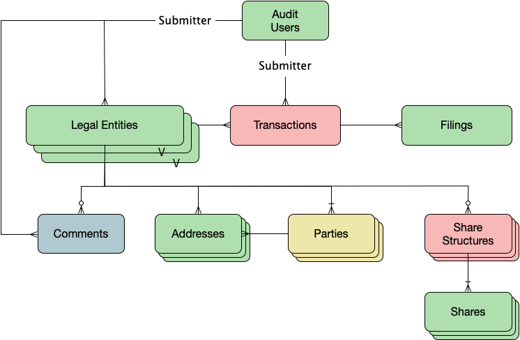

- Start Date: 2019-04-26
- Target Major Version: File an Annual-Report
- Author: thor@wolpert.ca
- Reference Issues: n/a
- Entity Issue:
- Implementation PR:

# Summary

The most basic Legal Entity is a business. All forms of businesses are modified through a series of filings. Historically these filings are paper-based and added in succession to a folder forming the history of a business.

The new model will continue with an immutable ledger that operates in a similar model to how banks, and online banking is viewed. This maintains the historical, legislative and most common mental approach for users of this system.

# Basic example

## Transactions and legal entity state
A transaction class that is treated as a set of immutable entries would provide a structure like the one below:

| id | transaction id | filing type | filing data |
|----|----------------|-------------|-------------|
| 10 |  10            |annual report| {filingType:'AR',filing:{date: '2018-04-10'}}|
| 11 |  11            |annual report correction| {filingType:'AR',filing:{date: '2018-03-29'}}|

Original filings, corrections, amendments, deletions and the state of the legal entity would all be treated as immutable. Changing anything would require new adding a new filing to alter the business entity into the desired state. The domain model then simplifies to only holding the current state of the legal entity.

## Historical state

Historical changes to a legal entity can be seen by retrieving the *filing* that was saved in the filing_data of the transaction.

For ease of determining the historical view of the legal entity at any point in time, a set of shadow domain objects will hold the changes that were applied to the model over time, allowing the domain objects to be rolled backward and forwards through time.

# Motivation

This proposal attempts to provide:
- an approach to maintaining a simple domain model to describe a *legal entity*
- a filing history that is immutable and easy to audit.
- a easy way of viewing the state of the entity at any point in time.

Currently the set of systems used by the registry are fairly complex models used to recreate filings by interpolating domain objects and handle the temporal record in model that does not fully take advantage of the technologies used to maintain it.

The goal here will be to provide a system that, in the most common case, returns the current state of entity efficiently, can return the state of the entity at any given point in time, and provide an immutable, audit-able trail of legal filings that were used to alter the state of the legal entity.

# Detailed design

The following Domain Model is what will be used to manage the legal state of a Legal Entity.

Filings are submitted in JSON using published JSONSchemas and stored in the database as ZIP
ed text (JSON) files. Enough meta data about the filing should be exposed to allow for ease of understanding and searching on filings, deep searching would need to expand the JSON or place them in the datalake for detailed analysis.

Most of the domain objects will be versioned, and the first cut of that will use a SQLAlchemy extension,
[sqlalchemy-continuum](https://github.com/kvesteri/sqlalchemy-continuum#sqlalchemy-continuum) to accomplish a versioned history of the legal entity.

The overall design approach is that each service owns its datastore exclusively, but if others will have direct access to the database, updateable views can be implemented and  allow only select on all tables and select/insert into the filing table. A job, or queued process would then update the current state of the businesses domain objects would apply that change - iff direct access would jeopardize the immutable approach of the design or if transactions rates were large enough to warrant filing submissions be separated from updating the domain model.

# Drawbacks

This approach uses a little more storage (average compressed filings are ~300 bytes), but that allows for an immutable audit trail to be implemented.

The legal entities history is maintained in a set of shadow tables, so queries would need to bring back current state and history from 2 tables, but the most common case is looking up the current state of an entity. Retrieving the current state is much easier and will use DB indexes, whereas the current implementations cannot fully utilize the technology as it relies on NULL values, which cannot be indexed.

# Alternatives

- The current approach of adding start/end IDs and searching on those retrieving the most current state by setting end-id=NULL. This creates a complex model, diminishes the use of indexes and based on the fact that the model has been used incorrectly many times, is obviously not very intuitive.

# Adoption strategy

*new build*

This RFC and the first cut of the filing API will implement this, allowing for the PR process to vet both the proposal and a functioning implementation.

# Unresolved questions

n/a

# Thanks

This template is heavily based on the Vue, Golang, React, and other RFC templates. Thanks to those groups for allowing us to stand on their shoulders.
