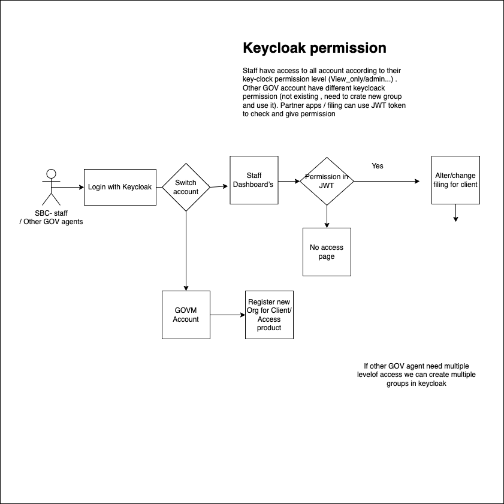

- Start Date: (2022-07-23)
- Target Major Version: N/A
- Reference Issues: (fill in existing related issues, if any)
- Entity Issue: https://github.com/bcgov/entity/issues/12226
- Implementation PR: None

# Summary

SBC staff need to access the staff dashboard with limited privileges to support SP/GP filing/alteration.

This is an RFC draft to discuss more suitable approaches 

# Motivation
SBC staff want to access the staff dashboard to search for SP/GP filing for clients, They may have to register SP/GP companies on behalf of the client
Currently all systems have to fake out an account id for staff, this is handled as an exception which in general not a good practice.
Other agencies (like sbc staff, GA, call-center, etc)) also run into these same problems, a suggested long term fix is to remove the exceptions and hard-coding of fake accounts and make these like all other Auth users.

# Solution Options
## 1) Use a new role for sbc staff from keycloak

### Summary
Keycloak Roles are currently used across the application to determine who can access the staff dashboard.
We can create a new keycloak role for sbc-staff and in code, we can use this group to give permission for required components/pages.
In this way, sbc-staff can do alterations for the organization on behalf of the user, and sbc-staff can use their GOVM account to create new SP/GP for Users
We can create a new GOVM account and add all BC Registry staff into that GOVM account where our staff can access the products as sbc-staffs do.

### Detailed design
1. Have to create a new role in keycloak for sbc-staff and
2. In code we have to check at all places where we need to give permission for the new role, like staffed
3. In addition to account (where they are part), we can show the staff dashboard in the menu, where they can switch between staff dashboard and account 
4. When sbc-staff/Registry staff access via staff dashboard, they can access all the accounts in our system (behalf of the user)
5. Sbc-staff/Registry staff can use their  GOVM account to create new organization/filing etc .. on behalf of clients and they can manage it.
6. Sbc-staff/Registry staff  can use their  GOVM account  to access products like PPR/Name requests to help the clients
7. As in existing we can have multiple staff groups to limit permission (search only/view/edit permissions)

This approach will have a high dev impact on sbc-auth and pay-api, less dev impact on and all partner applications (All partner app can directly check user role from keycloak JWT tokens for staff/other GOV agents)

## 2) Bring all Registry staff into one account and connect accounts using account delegation

### Summary
Currently, the Registry staff is not part of any accounts, and the Registry staff's role is being verified directly from keycloak. As a part of this solution, all users will be under at least one account and Registry staff will be deligated to all accounts according to access permissions. Then we will handle granular permission for staff from sbc-auth like end-users.
The same will apply to sbc-staff also. Sbc-staff will delegate access to accounts which they want to work on behalf of the client

It will be similar to the below RFC (instead of entity, the account will be deligated to another account)
https://github.com/bcgov/entity/blob/master/rfcs/rfc-delegation-and-permissions.md

### Detailed design
1. Account will be deligated to another account
2. All permissions will be granular level, Auth API will control Permissions
3. All partner apps should have to make an API call to Auth API and get permissions before allowing access to the application
4. We can show/hide components depending on their permissions.
5. Staff have access to all functionality (with higher permissions)
6. sbc-staff can assign fewer permissions than staff.

This approach will have a high dev impact on both sbc-auth and other applications (partner applications including Registry products like PPR, Business registry, and public partner products like Wills, RPT, etc will need to make a call to sbc-auth to check permission)

# Adoption strategy

If we implement this proposal, how will existing developers adopt it? Is this a breaking change? How will this affect other projects in the Entity ecosystem?

# Unresolved questions

Optional, but suggested for first drafts. What parts of the design are still TBD?

# Thanks

This template is heavily based on the Vue, Golang, React, and other RFC templates. Thanks to those groups for allowing us to stand on their shoulders.

