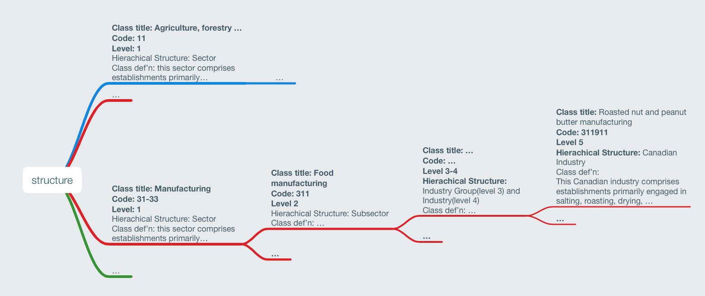
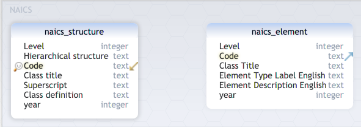
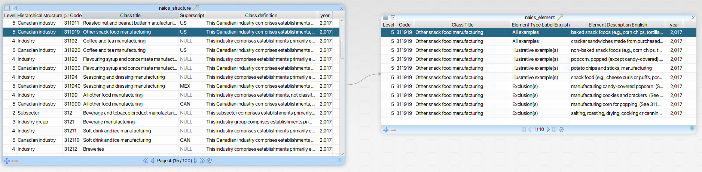

- Start Date: 2022-01-13
- Target Major Version:
- Reference Issues: [9502](https://github.com/bcgov/entity/issues/9502)
- Entity Issue: 
- Implementation PR: (leave this empty)

# Summary

This RFC outlines how the NAICS data provided by Statistics Canada can be used to implement a solution for
NAICS descriptions/codes search functionality.

The factors that led to the decision to use Statistics Canada data to drive the NAICS search implementation include
the following:
* Publicly accessible NAICS data in CSV format that provides data needed to drive search based off of terms/keywords 
  without need to screen scrape or pay for data
* Site is actively updated providing guidance on when new NAICS versions are going to be available
* NAICS hierarchy/structure data is also provided if we ever decide to provide more advanced search or browsing 
  capabilities
* Export format can likely be used on backend with minimum effort
* Able to leverage existing BE infra/code as we can continue following our existing flask based approach for api 
  implementation 
* The Statistics Canada data actually has additions specific to Canada so it makes sense to use this dataset

Some other options were also considered, but ultimately using the Statistics Canada data solution seemed to be the most 
straightforward from an implementation, maintainability and extensibility standpoint.

# Motivation

To provide a way for Name Request and Create UI to look up NAICS descriptions/codes that does not require a significant
amount of development effort.

# Detailed design

The general design is to make use of the NAICS structure and element data provided by Statistics Canada to drive the
implementation of a simple Flask based endpoint for searching NAICS descriptions/codes.

NAICS Structure Data - https://www.statcan.gc.ca/eng/statistical-programs/document/naics-scian-2017-structure-v3-eng.csv \
Provides data that defines hierachical structure leading up to the full classification code for a business.


NAICS Element Data - https://www.statcan.gc.ca/eng/statistical-programs/document/NAICS-SCIAN-2017-element-v3-eng.csv \
Provides example(s) and exclusion(s) for a classification code if any.


The structure of the two CSV files provided by Statistics Canada can be used almost as is with perhaps the addition of 
a year column to support updates to NAICS codes which occurs every five years.  The following is what a database 
structure might look like.





Given the defined database structure above, to determine potential matching NAICS descriptions/codes for a given search
term, the full(level = 5) codes of the NAICS structure and NAICS element data can be joined on level, full code and 
year. With this set of joined data, a query can be constructed to find rows in the dataset where relevant columns match 
the search term.

Example of a potential query to search for NAICS descriptions/codes related to the search term of "roast"
```sql
select s.Code, s.Class title
from public.naics_structure s
         join
     public.naics_element t on (s.Level = t.Level and s.Code = t.Code and s.year = t.year)
where s.Level = 5
  and s.year = 2017
  and (
        (s.Class title like '%roast%' or s.Class definition like '%roast%')
        or
        (t.Element Type Label English like '%roast%' or t.Class Title like '%roast%' or
         t.Element Description English like '%roast%')
    )
group by s.Code, s.Class title;
```

Sample output of query results using data imported to Postgres from 2017 Statistics Canada NAICSs structure and elements
csv files.
```
Code   Class title                                                          
====== ==================================================================== 
112320 Broiler and other meat-type chicken production                       
311340 Non-chocolate confectionery manufacturing                            
311351 Chocolate and chocolate confectionery manufacturing from cacao beans 
311911 Roasted nut and peanut butter manufacturing                          
311919 Other snack food manufacturing                                       
311920 Coffee and tea manufacturing                                         
327410 Lime manufacturing                                                   
333248 All other industrial machinery manufacturing                         
335223 Major kitchen appliance manufacturing                                
413130 Poultry and egg merchant wholesalers                                 
413190 Other specialty-line food merchant wholesalers                       
```

From an API consumer perspective, the endpoint may look something like `{{api-base-url}}/naics?year=2017&term=roast`.

This is a minimal implementation of what a search based off of year and search term would look like.  The data will be
in place to support more advanced search capabilities or if there is a desire to provide a way to browse the hiearchical
structure of the classifications.

# Drawbacks

There is some development effort required in implementing a backend solution as opposed to using a solution that is more
out of the box.  Given that there did not seem to be any viable options, this is still a relatively low effort solution 
if the minimal search proposed in the detailed design will suffice.

# Alternatives

The following two options were also considered.

| Alternative                                                       | Description                                                                                               | Notes                                                                                                                                                                                                                                                                                                                                                                                                                                                                                                                                                                                                 |
|-------------------------------------------------------------------|-----------------------------------------------------------------------------------------------------------|-------------------------------------------------------------------------------------------------------------------------------------------------------------------------------------------------------------------------------------------------------------------------------------------------------------------------------------------------------------------------------------------------------------------------------------------------------------------------------------------------------------------------------------------------------------------------------------------------------|
| NAICS Association <br> https://www.naics.com/search/              | Provides paid NAICS API solution                                      | <ul><li>Simple and easy to understand search based off of NAICS keyword search</li></ul>                                                                                                                                                                                                                                                                                                                                                                                                                                               |
| Code for America <br> https://github.com/codeforamerica/naics-api | NAICS API that gets NAICS data by scraping US Census site data | <ul><li>Able to get it up and running</li><li>Search term endpoint doesn't seem to work completely.  A lot of search terms seem to return all NAICS data.</li><li>No longer maintained (last updated 8 years ago)</li><li>Running on very old version of node 0.10.x.  Would require some work to update node version and likely dependencies.</li><li>NAICS classification is running on 2012 data right now which would require an update but scraper code doesn’t work as is right now. This likely due to fact that structure of US Census site from which data is scraped has changed.</li></ul> |


# Adoption strategy

Import all NAICS structure/element and implement minimal search functionality.  More advanced search and hiearchical
browsing functionality will be possible if that is required in the future.

# Unresolved questions

Is the minimal search functionality of providing a search term and returning full NAICS code and classification title 
sufficient?

# References

[NAICS Association](https://www.naics.com/search/)

[NAICS Statistics Canada version 3.0](https://www.statcan.gc.ca/en/subjects/standard/naics/2017/v3/index)

[Code For America NAICS API](https://github.com/codeforamerica/naics-api)

[US Census NAICS](https://www.census.gov/naics/)

