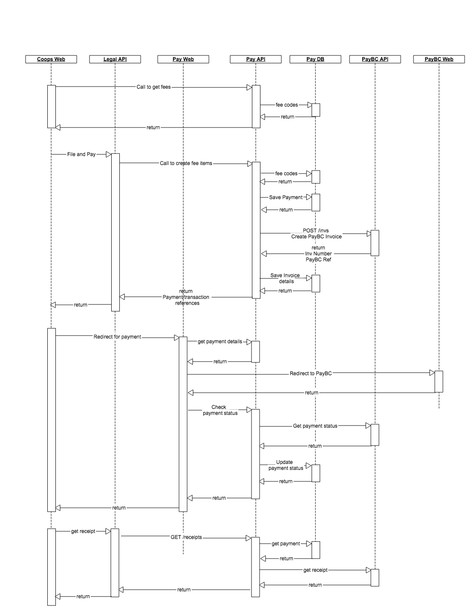

- Start Date: 2019-04-23
- Target Major Version: None
- Reference Issues: 
- Entity Issue: github/entity#496
- Implementation PR: (leave this empty)

# Summary
Registry Payment System flow

# Basic example

# Motivation

The registry applications would need a payment system to calculate fees and to create payment related records. 

# Detailed design

The pay-api would be responsible for the following;
   * Calculate the fees for a filing
   * Store the fees information
   * Create payment records in payment system (PayBC for now, and would support other payment system in future)
   * Create receipts for the payment by combining entity information and receipt information from payment system (PayBC)
   * Retrieve fees history information

The sequence diagram below shows the flow on below conditions;
   * Calculating the fees : This flow will be used by filing application whenever someone is filing
   * Creating the Fees record : This flow will be used when the user finishes the filing and is ready to pay
   * Payment : This will be used when the filing is complete, and fees and payment records are created. 
   * Receipt : This will be used when the payment is complete and the filing application needs a receipt of payment. 

### Documentation

The interfaces will all be documented and exposed via OAS (Open API Specification) v3 or better.

All payloads will be JSON, with associated and published JSON Schemas.

# Drawbacks

# Alternatives

# Adoption strategy

# Unresolved questions

None.

# Thanks

This template is heavily based on the Vue, Golang, React, and other RFC templates. Thanks to those groups for allowing us to stand on their shoulders.
