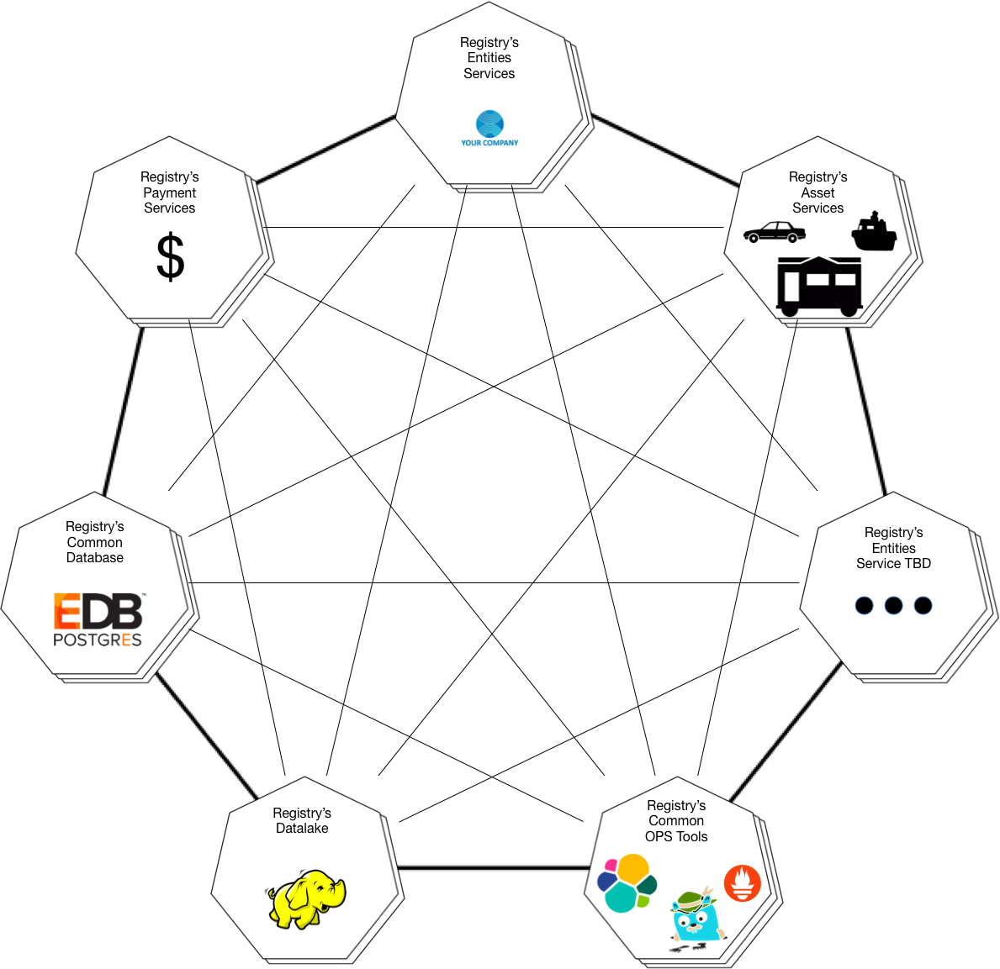

- Start Date: 2019-0417
- Target Major Version: None
- Reference Issues: 
- Entity Issue: github/entity#474
- Implementation PR: (leave this empty)


# Summary

The Registry has some common tools, databases and utilities that require other protocols other than HTTPS, which is the only useable protocol currently support by the CSI platform.

In order to support this approach and need, the Registry namespaces have been joined together.

# Basic example


``` bash
# export ENV="dev"
# oc get netnamespaces | grep -E "hak2zo|fsxqpf|d7eovc|l4ygcl|1rdehl|gl2uos|servicebc-ne-" | grep ${ENV}
1rdehl-dev              10664717   []
d7eovc-dev              9341230    []
fsxqpf-dev              763899     []
gl2uos-dev              13443139   []
hak2zo-dev              12233253   []
l4ygcl-dev              13868868   []
servicebc-ne-dev        13026907   []
# oc adm pod-network join-projects --to=hak2zo-${ENV} fsxqpf-${ENV} d7eovc-${ENV} l4ygcl-${ENV} 1rdehl-${ENV} gl2uos-${ENV} servicebc-ne-${ENV}
# oc get netnamespaces | grep -E "hak2zo|fsxqpf|d7eovc|l4ygcl|1rdehl|gl2uos|servicebc-ne-" | grep ${ENV}                                   
1rdehl-dev              12233253   []
d7eovc-dev              12233253   []
fsxqpf-dev              12233253   []
gl2uos-dev              12233253   []
hak2zo-dev              12233253   []
l4ygcl-dev              12233253   []
servicebc-ne-dev        12233253   []
```

# Motivation

Generally a service wants complete control of all of its immediate dependencies, but that is not always attainable and in the case of managing the orchestration and operation of a series of services can even be undesirable.

### Database / Data Storage
The Registry requires the uptime of highly available (HA) data storage services. As these require many resources to operate, this will be done in a shared nature. In order to still give consuming resources greater autonomy, each service will have its own protected schema, ensure that schema level recovery is in place, and that advanced features of the data store that are highly version dependent are avoided.

### Monitoring / Tracing / Metrics
In order to provide a high level of support, in addition to support debugging and maintenance across services, there must be common services capable of aggregating operating data across business oriented services.

# Detailed design

### Common Core Services
Common core services, which are mostly 3rd party applications, will be installed and commonly accessed via their supported network protocols directly between Namespaces.

Examples of these are: Jaeger, EnterpriseDB, Hadoop, Kafka, etc.

### Intra-Registry Business Services
All internal business oriented services will communicate directly over HTTPS or HTTPS/2 including the use of wrappers such as gRPC.

### Inter-Registry Business Services (External Facing)
All externally exposed business services will communicate via HTTPS or HTTPS/2.

The interfaces will all be documented and exposed via OAS (Open SPI Specification) v3 or better.

All payloads will be JSON, with associated and publiched JSON Schemas.



# Drawbacks

The platform only provides for joining the namepsaces into all together, rather than activing more like network routing that could ensure directionality and limit which segments can be accessed. In the case of joined namespace, any service can access any other namespaces services directly.

More care must be taken to ensure that services are communicating over the correct network path and that non-HTTP based protocols do not proliferate beyind whatThe 3rd Party commonly used packages require.

No doing so could make the bespoke Registry services more difficult to move to other platforms or cloud providers.

# Alternatives

The HA databases could be deployed in every namespace, but the added licensing costs and complexity of support outweighed any justifications to do so.

Tools such as Jaeger could have their agents wrapped in an HTTP server, but the added latency and security overhead again defeated much of the purpose of this type of tool/product.

# Adoption strategy

Common services and adapting the business services to use them will be managed via individual stories and tickets, making it no differnet than any other feature added to the environment. The joining of the namespaces just provides the capability for better, or in some cases the only access to common services.

# Unresolved questions

None.

# Thanks

This template is heavily based on the Vue, Golang, React, and other RFC templates. Thanks to those groups for allowing us to stand on their shoulders.
