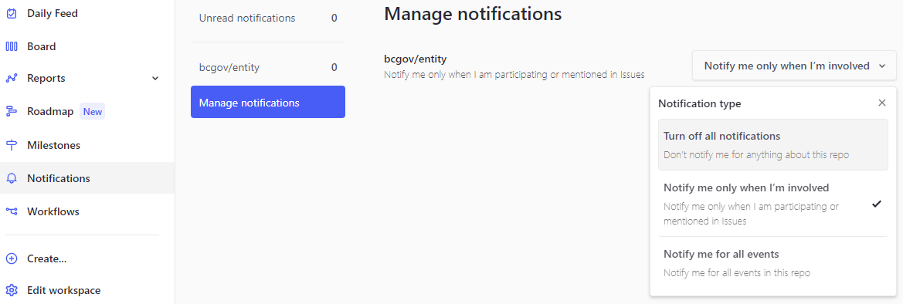
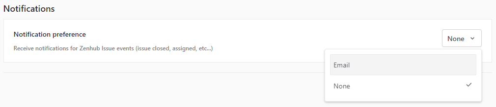
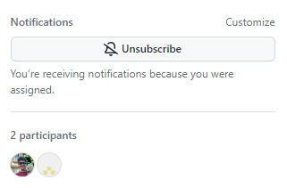
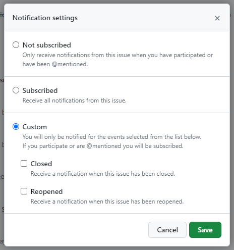
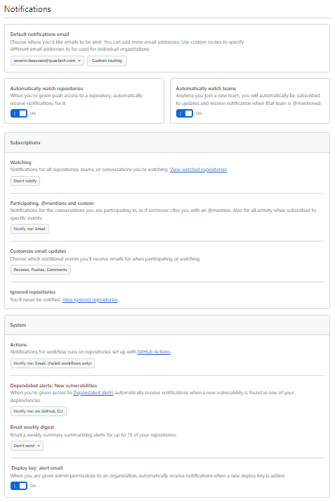
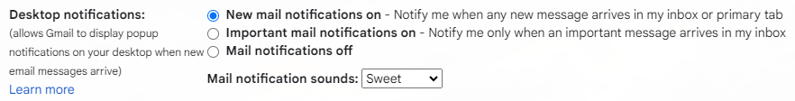
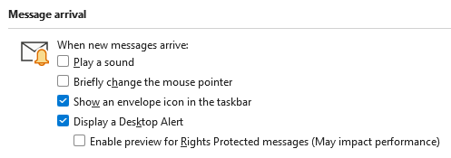
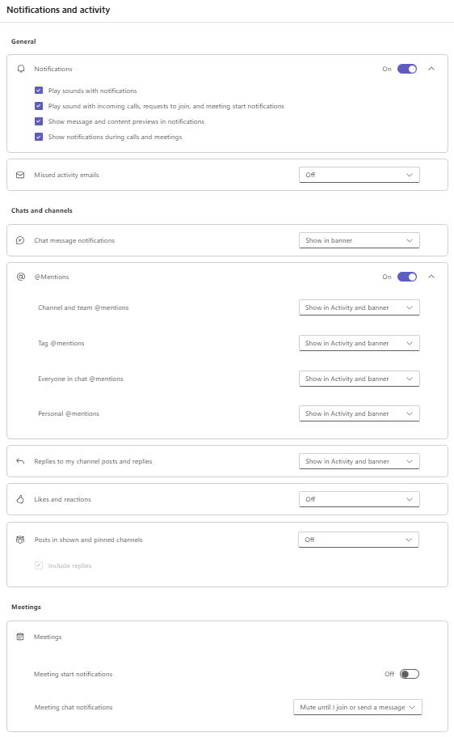
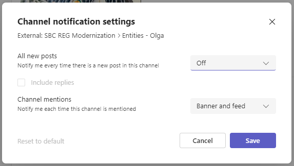

- Start Date: 2024-03-06
- Target Major Version: None
- Reference Issues: https://github.com/bcgov/entity/issues/19968
- Entity Issue: 
- Implementation PR: 

# Summary

This RFC reviews the current process for notifications about ongoing work and summarizes problems, from the point of view of a BCROS team. Then, it reviews best practices that promote transparency, collaboration and efficiency. Finally, it proposes processes that would work best for the team.

Notifications are especially important due to many team members working off-site and still needing to keep up to date with everything.

# Motivation

Team members use multiple systems every day to communicate amongst themselves, with each system able to generate notifications.

On the one hand, a member may receive a large number of notifications, which may repeatedly interrupt their concentration on their current task, may affect their health and well-being, and is likely to reduce their productivity.

On the other hand, a member who has not enabled notifications or ignores them may miss relevant and timely design discussions or calls to action (eg, PR reviews, meetings, etc), likely reducing their effectiveness and possibly reducing the team's productivity.

The known problems are summarized as:
1. Some team members are unaware of some requests or events.
2. Some team members take a long time to (or don't) respond to notifications, potentially delaying other people or missing meetings.
3. Some team members are bogged down with too many notifications.

Therefore, the goals are:
1. Transparency: Keep all team members informed of what's going on.
2. Collaboration: Facilitate all team members getting responses to questions, and general responsiveness.
3. Efficiency: Allow all team members to be focused on their own work without undue interruptions, while being able to reach other team members promptly if needed.

The expected outcomes of this RFC are a list of things that a team member should remain updated about (either via notifications or other means), and some recommended best practices to improve communication while managing productivity. It is expected that this RFC does not need to be approved or rejected, but rather that processes be proposed, discussed and then adopted accordingly.

# Detailed design

A notification informs someone about something that has happened or will happen (eg, a comment was added to an issue, or a meeting has been scheduled).

A notification can take various forms, and depends on the user's environment (eg, desktop vs mobile, Mac vs PC, etc). It can be an app notification or a desktop / system notification. It may just display an icon or count, or it may display an alert or play a sound. Note that some notifications are easier to ignore than others. This is amplified below in the [Current process](#current-process) section.

Sometimes, a team member needs to be "heads down" on a task and prefers to be uninterrupted for a time. It is not expected that this person would re-configure their notifications, although they may temporarily mute them or close the offending app or just wilfully ignore them. This is an edge case and can be managed by advance notice that this person will be less responsive than usual, and handled accordingly.

Sometimes, a team member is not 100% allocated to one team and will have time / days where they are unavailable. From their point of view, they will need to manage incoming notifications so that they can remain focused on their current team while, ideally, remaining responsive to their other team(s) -- which is the theme of this RFC. From others' point of view, notice of their unavailability would be helpful to avoid any blockers -- asking questions ahead of time, or working on something else while awaiting an answer. This is an edge case similar to the one above.

Another edge case is notifications during off-work hours. It is not generally expected that team members be responsive when away from work, so this is out of scope.

The priority / level of a notification needs to be considered -- some should be seen as soon as possible while others can maybe wait a day.

Finally is the subject of responding to notifications -- some should be acknowledged (eg, thumbs up emoji), some may need a response (eg, meeting invite), and some don't need a response. This is obviously contextual and guidance is provided in the [Best practices](#best-practices) section below.

## Current process

Team members use the following systems daily:

### Microsoft Teams

This software is primarily used for individual / group / team messaging and conferencing. MS Teams is the main team collaboration application used by BCROS teams.

MS Teams supports "activity" and "banner" notifications for the Activity page and each team (aka channel) the user has access to. In addition to bolded headers in the app and a badge on the tray icon, Teams may generate popups and a sound through the desktop (eg, Windows Notifications), which are hard to ignore.

In the author's experience, MS Teams generates a lot notifications, by virtue of the many teams and chat groups subscribed to.

:warning: MS Teams messages are purged after a while according to retention policies. Hence, distribution of information that is meant for future reference should be done by email (where messages can be filed into folders permanently) or other methods.

:warning: Some team members use the browser version of MS Teams. To keep MS Teams running, they must must ensure that the subject browser tab remains active (eg, is exempted from the browser's memory saving configuration). Also, the browser must be configured to allow the subject website to send notifications.

### Zenhub

This software is a "layer" on top of GitHub Issues and provide workspaces, sprint flows, pipelines, and various reports.

Zenhub appears to support only basic local and email notifications for issue events, but as is it built upon GitHub, GitHub notifications can be used instead as they are more configurable.

### GitHub

This system stores BCGov repositories, personal repos, and provides branching, Pull Request (PR) flows and merging. This system also stores Issues, although most developers probably view issues in the Zenhub "view". GitHub supports lots of local and email notification options, including the concept of "subscriptions", which allows users to "watch" only the specific items they care about.

In the author's experience, GitHub generates a lot of notifications, which can be received on the GitHub site (or CLI) or via email. The author recommends receiving emails ("push") instead of checking GitHub ("pull"). The author finds email notifications easy to temporarily ignore, and GitHub emails particularly quick to review and handle -- items that need follow-up can be left in the Inbox and other items can be promptly deleted.

### Email

This system allows for messaging between single or multiple individuals. This is a corporate system and every team member has access to it.

Incoming emails generally display a notification, although filters or rules can be configured in most email clients to automatically dispatch certain emails, thus avoiding a notification.

In the author's experience, email generates a lot of notifications, either about operations (eg, customer issue, specific design questions, meetings) or sent from another system (eg, GitHub). However, as mentioned in [GitHub](#github) above, emails seem to be easy to handle, likely because selected items can be left in the Inbox for later response (ie, as a kind of "to do list") instead of getting "lost" in a long chat stream.

In the author's experience, the High / Low Importance flags on emails is used inconsistently and is therefore not useful for determining objective message priority. Internal guidance could be provided for better setting this flag, thereby adding a useful priority level to some emails, but since emails come from all different organizations, this is unlikely to be a general improvement. Therefore, the Importance flag is not discussed further in this RFC.

:bulb: Email is a good system to use for group discussions that include people who don't have access to MS Teams.

:bulb: Email is a good system to use for discussions that should be saved (eg, in a folder) for possible future reference.

:warning: To access their government email account, non-government employees (ie, contractors) must use the browser version of Outlook (`summer.gov.bc.ca`). Unfortunately, this site times out every 5 minutes or so, meaning that government email (or calendar) notifications can easily be missed. To mitigate this, emails to contractors should also be sent to their non-gov email address. (Email forwarding appears to be disabled.) Also, contractors should login to `summer` to check for missed emails once a day or so. Resolving this issue is not in the scope of this RFC.

### Personal direct messaging

Direct messaging system such as SMS, Google Chat, Apple Messages, or WhatsApp allow for messages (or "chats") between single or multiple individuals. As the user's id is generally their personal phone number or personal email address, these are not a usual means to communicate between team members.

In the author's experience, notifications from personal direct message apps seem to be harder to ignore, perhaps because they are generally reserved for personal use or specific work situations. Hence, personal direct messaging can be useful for contacting a team member who is not responding to MS Teams or email (perhaps because they are out of office at the time). However, at the moment, there is no expectation or provision for all team members to be available on SMS, so this should be used sparingly for high importance work purposes only, if at all.

# Best practices

Team members should stay abreast of:
- organizational news,
- team meetings (especially late-scheduled or ad hoc meetings), including meeting agendas and minutes,
- team daily check-in (if used),
- personal requests for help (eg, Pull Request reviews, questions for which you are a Subject Matter Expert),
- general requests for help (eg, does anyone know about _? is anyone else experiencing _?),
- issue (aka ticket) or PR questions and responses,
- issue or PR state changes and assignments.

To promote transparency, the things that need to be known by all team members should be posted to a system that generates appropriate notifications, and all teams members should monitor those notifications. Examples include a team announcement, an important design decision, a plan for a key person to be temporarily unavailable, etc.

To promote collaboration, in addition to posting about and looking at team requests and events, team members should review notifications in an appropriately timely manner. This can be accomplished by assigning different priority levels, for example:
1. High priority - should action as soon as possible (eg, ad hoc meetings, questions directed to particular people).
2. Regular priority - should action within an hour or so (eg, check in, deployments, general / group questions, PR reviews).
3. Low priority - should action within half a day or more (eg, informational content, discussion about future work items).

To promote efficiency, team members must stay productive with their own work and avoid delaying other people. This is amplified in [Proposal](#proposal), below.

# Proposal

The following practices are proposed:
1. Post more-important things to the appropriate audience (person or group) and system.
2. Post less-important things to secondary channels or systems.
3. Respect a team member's "heads down" time when requested.
4. Let the team know if you need temporary heads-down time.
5. Let the team know if you'll be temporarily away from your keyboard (and when you return).
6. Avoid sending excessive notifications (eg, add reviewers _after_ adding a lot of comments to your own PR).
7. Avoid sending multiple notifications (or over multiple systems) in order to get a team member's attention.
8. Subscribe to (and configure notifications for) all topics you need to remain updated about.
9. Configure different levels of notification for different events / channels (eg, badge only vs alert / sound).
10. Respond to notifications according to priority level.
11. Consider using your mailbox (or other system) as a "to do list".
12. Consider sharing your personal direct messaging info with your manager if you know you will not have access to other notification systems; this is especially true for key team members.

## Specific recommendations

Although there is some leeway in how a team member configures different app / system notifications -- as long as they remain appropriately notified -- the following are recommended:

**MS Teams:**
- Use individual messaging in MS Teams to reach someone promptly.
- Review and respond to your individual chats frequently (ie, review as soon as possible; respond according to priority).
- Use MS Teams to keep team abreast of activities.
  - Enable banner / feed notifications for primary team channel.
  - Enable feed only for other channels.
  - Hide channels you don't need to follow (which disables their notifications).
  - Use the Activity page and notifications to see the latest messages.
- Review MS Teams regularly (every hour or so).
- Recommended channels to monitor:
  - The member's primary team channel(s) (eg, Entities-Olga and Entities Product Team).
  - Any project-specific channel, if applicable.
  - The general Developer's channel.
  - The general General channel.
  - Other team channels as needed for collaboration (but likely disable their notifications).

**GitHub / Zenhub:**
- Enable email notifications in GitHub, and subscribe to issues you need to watch.
- Unsubscribe from issues you no longer need to watch (eg, a ticket you created but another team is now handling).
- Ignore notification settings in Zenhub in favour of GitHub notifications.

**Email:**
- Use email for notifications that shouldn't get "lost" in message streams.
  - can be used as "to do list"
  - messages can be saved in a folder for possible later retrieval
- Review GitHub notifications (in email) regularly (every hour or so).
- Use email for low-priority interruptions that can be handled later.
- Review low-priority emails within half a day or more.
- Use email filters to auto-delete irrelevant notifications (eg, Sonarcloud).
- Learn to quickly review and delete / ignore notifications that don't affect you.

# Drawbacks

Configuring systems to send or display extra notifications may increase a team member's current notification workload. However, this may be balanced by the need for that member to be aware of team activities.

Implementing the proposed practices and recommendations above will require teaching some people.

Some team members may choose to keep their personal direct message ids (eg, phone number or email) private, removing this option to reach them outside the normal work systems.

# Alternatives

No alternative designs have been considered. This is about using the existing tools to their maximum potential.

The impact of not configuring notifications ideally is described in [Motivation](#motivation), above.

# Adoption strategy

Team members should consider following the practices and recommendations in [Proposal](#proposal), above. There is some leeway and there may be alteratives that meet the same objectives of "not missing anything important" while "not interrupting team members constantly", and that's left to each individual member.

This is not a software or design change and, as such, it is not a breaking change and does not affect other projects. However, while this RFC originated from a particular BCROS team, its guidance may benefit other teams.

:bulb: This RFC should be provided to new team members as part of their onboarding process. Awareness of the issues and processes in this RFC will help to make a team with off-site members as productive as possible.

# Unresolved questions

No research was done on alternate notification mechanisms. The focus was on tools that are currently being used broadly. There may be, now or in the future, a better notification system that will improve team transparency and collaboration, while minimizing team member inefficiency. It is unknown if such a system could even be implemented in the current corporate environment.

# Thanks

This template is heavily based on the Vue, Golang, React, and other RFC templates. Thanks to those groups for allowing us to stand on their shoulders.

# Appendix - Sample configurations

## Zenhub notifications

<figure>
  <figcaption>Zenhub Notifications Management</figcaption>
  
</figure>

<figure>
  <figcaption>Zenhub Account Notifications Preference section</figcaption>
  
</figure>

## GitHub notifications

<figure>
  <figcaption>GitHub Issue Subscription</figcaption>
  
</figure>

<figure>
  <figcaption>GitHub Issue Subscription Settings</figcaption>
  
</figure>

<figure>
  <figcaption>GitHub Notifications</figcaption>
  
</figure>

## Email notifications

<figure>
  <figcaption>Gmail Desktop notifications section</figcaption>
  
</figure>

<figure>
  <figcaption>Outlook Message arrival section</figcaption>
  
</figure>

## Microsoft Teams notifications

<figure>
  <figcaption>MS Teams Notifications and activity page</figcaption>
  
</figure>

<figure>
  <figcaption>MS Teams Channel notification settings dialog</figcaption>
  
</figure>

