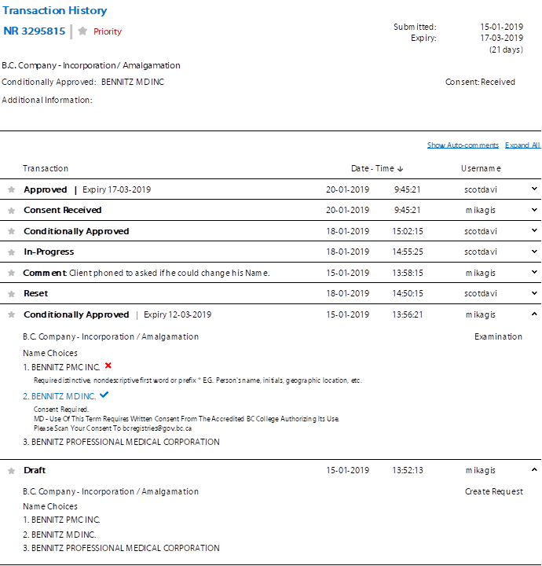

- Start Date: 2019-01-31
- Target Major Version:
- Reference Issues: n/a
- Entity Issue: /bcgov/entity/issues/98
- Implementation PR: (leave this empty)

# Summary

The legacy NRO system provides a feature to show detailed changes of an NR as it is processed. Most of the information that the examiners are looking for already exists on the main details page for an NR, but showing the historical edits and transitions is not listed in the UI.

This proposal is to add that functionality to NameX and the Name-Examination UI.

# Basic example

N/A, see the detailed design section

# Motivation

This effort will add data and historical tracking that is somewhat available in the legacy environment and will need to exist before NRO can be decommissioned.

If this proposal is not accepted, then an alternate will need to be created to meet the business requirement.

# Detailed design

## API change

A new end-point to provide the transaction details for the NR will be added. The json payload will have the long running record of changes to an NR.

Existing end-points follow a RESTful pattern of `/api/v/requests/{nr number}`

An addtional end-point will extend this to `/api/v/requests/{nr number}/history`

## API Service

There are a number of different patterns for tracking changes to data and its associated schema. Its proposed to use SQLAlchemy life-cycle hooks to insert changes made to an entity into historical tables. This can be accomplished by writing code to perform these actions on the life-cycle hooks, but there is a SQLAlchemy extension,
[sqlalchemy-continuum](https://github.com/kvesteri/sqlalchemy-continuum#sqlalchemy-continuum)
that provides this service as well. It's proposed to use that in the first rollout of the service changes. As of this time there are 25 active committers on the project.

## Examiner UI

In discussion with the team it was decided to create a new UI page & app to hold the txn history info, given that the current name-examination screens aree undergoing a significant UI change.

This build will take advantage of vue-cli3, jest & nightwatch, as well as leverage the [vuetify](https://vuetifyjs.com) material components.

The UX team has put forward the following as the initial design (no addittional components or UI artifacts should be added without involvement of the UX/UI team):

# Drawbacks

- The audit feature affects the core model of the API service, and may have uninintended consequences.
- All of the best options leverage SQLAlchemy. This keeps the database as a dumb datastore, and as such the historical pattern of doing data fixes directly on the database will not auto-magically pick up changes to the data in the table.

# Alternatives

- Adding triggers to the database tables. This would bind us even closer to postgres, or other DB technologies.
- Similar approaches can be used that send events to a messaging service so that history is added asynchonously. Based on the low volume of incoming names and changes this optimization seems early and too expensive.
- Kafka streaming could be used to create another data area that has the evolving NR record. This may be advantageous when other services are added, but again this is a large set of infrastructure additions for an, as of now somewhat smaller addition.

# Adoption strategy

This could be added in stages across the model to capture changes, in either a limited fashion or as required beyond the basic MVP needs.

# Unresolved questions

Impacts to storage, monitoring or overall performance has not been quanitfied.
