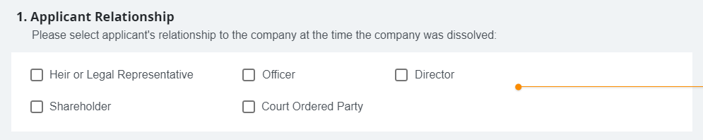

- Start Date: 2023-03-06
- Target Major Version: n/a
- Reference Issues: bcgov/entity#15509
- Entity Issue: 
- Implementation PR: 

# Summary

This RFC seeks feedback to help improve the application architecture of
business-filings-ui, business-create-ui and business-filings-ui.  At present,
we use props and events to communicate between form components like this:

```javascript
<CourtOrderPoa
  :draftCourtOrderNumber="getCourtOrderStep.courtOrder.fileNumber"
  :hasDraftPlanOfArrangement="getCourtOrderStep.courtOrder.hasPlanOfArrangement"
  :courtOrderNumberRequired="false"
  :invalidSection="isCourtOrderInvalid"
  @emitCourtNumber="setCourtOrderFileNumber(\$event)"
  @emitPoa="setHasPlanOfArrangement(\$event)"
  @emitValid="setCourtOrderValidity(\$event)"
/>
```

We're proposing to modify the form components to use Vuex or Pinia getters and mutators instead.

# Basic example

Each form component would be passed a store location as a string like this: 
```javascript
<CourtOrderPoa path="some.location.in.the.store" />
```

The component then gets its default values from the store location and, when the user modifies
the form, the component mutates the store location provided.

# Motivation

There are three primary goals:

First, separation of concerns.  At present, the parent component must know about each field in 
the child component.  This makes changes more difficult as both the child and the parent must be
modified.

Second, make the component reuse easier. Using the new approach, components can be reused calling
the component and providing a store location.  Using the existing approach, each field's needs to
be "wired-up" with a prop and an event listener.

Third, make forms that use progressive disclosure easier to implement. Using the existing approach,
if the child component sometimes returns additional fields, the parent must "know" about the
fields and handle the additional complexity.  Using the new approach, the knowledge of the 
additional fields could be contained to the child component making progressive disclosure
easier to implement.

As side benefit, using the new approach makes the child component fully reactive.  The current 
approach copies the props to mutable local variables when the component is mounted.  The values
are not reactive from outside the component once the child component is mounted.

# Detailed design

Here's an example of a simple series of checkboxes:



This would be implemented by calling 5 checkboxes with the store location (aka: `path`):
```javascript
<SingleCheckbox v-for="(item, idx) in checkboxes"
  :item="item"
  :id="idx"
  :key="idx"
  :path="path"
/>
```

Then the `SingleCheckbox` component could be re-used anywhere a checkbox is requested.

#### SingleCheckbox.vue
```javascript
<template>
  <v-checkbox v-model="attribute"
              :id="id"
              :value="item.value"
              :label="item.label" />
</template>

<script>
import { mapActions, mapGetters } from 'vuex'

export default {
  name: 'SingleCheckbox',
  mixins: [FieldMixin],
  props: {
    path: {
      type: String,
      default: null
    },
    id: {
      type: String,
      default: null
    }
    item: {
      value: {
        type: String,
        default: null
      },
      label: {
        type: String,
        default: null
      }
    }
  },
  computed: {
    ...mapGetters(['getNestedAttribute']),
    attribute: {
      get () {
        return this.getNestedAttribute({ path: this.path, id: this.id })
      },
      set (value) {
        const payload = {
          path: this.path,
          id: this.id,
          value: value
        }
        // value is true when the checkbox is selected
        if (value) {
          return this.addItemToCheckBoxList(payload)
        } else {
          return this.deleteItemFromCheckBoxList(payload)
        }
      }
    }
  },
  methods: {
    ...mapActions(['addItemToCheckBoxList', 'deleteItemFromCheckBoxList'])
  }
}
</script>
```

Below are the relevant getters and actions. 

#### Getters
```javascript
/** Get attribute from the store by passing a string as a path to the store and the attribute's id
 * Like this: getAttributeByPathAndId('location.in.the.store', 'attribute_id')
 * passing the path and id separately avoids having to concatenate the path and attribute id repeatedly.
 * The id parameter is optional which is handy for fetching a list before adding or removing an
 * element from the list.
 * */
getNestedAttribute: (state: StateIF) => (payload: StoreAttributeGetIF): string => {
  let pathArray = payload.path.split('.')
  if (payload.id) {
    pathArray.push(payload.id)
  }
  return nestedFunctions.getProp(state, pathArray)
}
```

#### Actions
```javascript
  /** Adds item to a list of items if it doesn't already exist.
   * Like: addItemToCheckBoxList({"id": "value_to_add", "path": "location.in.the.store", "value": "<ignored>"})
   * */
  addItemToCheckBoxList (context, payload: StoreAttributeModifyIF) {
    let newPayload = {
      id: null,
      path: payload.path,
      value: [payload.id]
    }
    let currentItems = context.getters.getNestedAttribute({ path: payload.path })
    if (currentItems && !(payload.id in currentItems)) {
      currentItems.push(payload.id)
      newPayload = {
        id: null,
        path: payload.path,
        value: currentItems
      }
    }
    context.commit('setNestedAttribute', newPayload)
  }

  /** Removes item from a list of items if it exists
   * Like: deleteItemFromCheckBoxList({"id": "value_to_add", "path": "location.in.the.store", "value": "<ignored>"})
   * */
  deleteItemFromCheckBoxList (context, payload: StoreAttributeModifyIF) {
    let currentItems = context.getters.getNestedAttribute({ path: payload.path })
    if (currentItems && currentItems.includes(payload.id)) {
      const indexOfItem = currentItems.indexOf(payload.id)
      currentItems.splice(indexOfItem, 1)
      const newPayload = {
        id: null,
        path: payload.path,
        value: currentItems
      }
      context.commit('setNestedAttribute', newPayload)
    }
  }
```

Since the location to the store could be deeply nested, recursive functions are used to get and set the
requested attribute.  These functions should be modified to receive the store location in dot notation
rather than arrays. For example, this, `location.in.the.store` instead of this, `["location", "in", "the", "store"]`.

#### Nested functions
```javascript
  /** recursive function that gets a nested store attribute when
   * passed the location in the store represented as an array of
   * strings like this:
   * getProp(store, ["location", "in", "the", "store", "attribute"])
   * The requested attribute can be nested multiple levels deep.
   * */
  getProp (store, nestedProperty) {
    const prop = nestedProperty.shift()
    if (!store[prop] || !nestedProperty.length) {
      return store[prop]
    }
    return this.getProp(store[prop], nestedProperty)
  }

  /** recursive function that sets a nested store attribute when
   * passed the location in the store represented as an array of
   * plus the new value to be saved. Like this:
   * setProp(store, ["location", "in", "the", "store", "attribute"], new_value)
   * The requested attribute can be nested multiple levels deep.
   * */
  setProp (store, nestedProperty, value) {
    const prop = nestedProperty.shift()
    if (!store[prop]) {
      Vue.set(store, prop, {})
    }
    if (!nestedProperty.length) {
      if (value && typeof value === 'object' && !Array.isArray(value)) {
        store[prop] = { ...store[prop], ...value }
      } else {
        store[prop] = value
      }
      return
    }
    this.setProp(store[prop], nestedProperty, value)
  }
```

We envision expanding the low-level components like `SingleCheckbox.vue` to include component
to display radio buttons, text fields and date fields etc.  Each of these components would talk
directly to the store using the store getter `getNestedAttribute` and the mutator `setNestedAttribute`.

The new approach has more advantages as the forms get more complex and have more nested objects.  For
example:

```html
<template>
  <FormRow>
    <InLineCheckBox id="corp_owner" :path="path" :option="true">
        Owned by corporate entity
    </InLineCheckBox>
  </FormRow>
  <!-- corporation sub-component start -->
  <FormRow v-if="getNestedAttribute(path, 'corp_owner') === true">
    <TextField id="name" :path="path + '.corporation'" rules="max:40">
      Corporation Name</TextField>
  </FormRow>
  <!-- corporation sub-component start -->
  <!-- individual sub-component start -->
  <FormRow v-if="getNestedAttribute(path, 'corp_owner') !== true">
    <TextField id="last_name" :path="path + '.individual'" rules="max:20">
      Owner's Last Name</TextField>
    <TextField id="first_name" :path="path + '.individual'" rules="max:20">
      Owner's First Name</TextField>
  </FormRow>
  <!-- individual sub-component end -->
  <FormRow>
    <TextField id="address" :path="path" placeholder="Address" rules="max:25">
        Address Line
    </TextField>
  </FormRow>
  <FormRow>
    <TextField id="city" :path=path rules="max:20">City</TextField>
    <ProvinceField id="province" :path=path>Prov / State</ProvinceField>
    <TextField id="postal" :path=path>Postal / Zip</TextField>
    <PhoneField id="phone" :path=path rules="phone">Phone</PhoneField>
  </FormRow>
</template>
```


# Drawbacks

We don't see this proposal as having significant drawbacks. If adopted, this new
approach could be implemented gradually and could be used alongside the current approach.

Some developers may have concerns about moving the business logic from components to the store,
but we suggest using Pinia for business logic is better and more flexible than storing 
business logic in components. We'd be interested in what the group's feedback might be on this topic.

Form validation is a big part of developing reusable form components. We haven't mentioned form
validation in this RFC, but would like to do so in a future RFC.

# Alternatives

We could use the Composition API instead of Pinia. The Composition API is native to Vue and has
the advantage of being lighter weight and more flexible. However, with Pinia the state is viewable
by developers using the Vue Devtools plugin, whereas shared state is not viewable when using the 
Composition API.

Also, creating sharable state using standard Vue doesn't offer the same safe guards as Pinia.
For example, with Composition API it's possible to mutate shared state directly like this:

```vue
<input v-model="common.state.attribute" placeholder="Enter your name" type="text" />
```

We can prevent the mutation of shared state by declaring the store "readonly", but by 
using Pinia we're forced to adopt a set of standards which is particularly helpful on 
large projects with many developers.  


